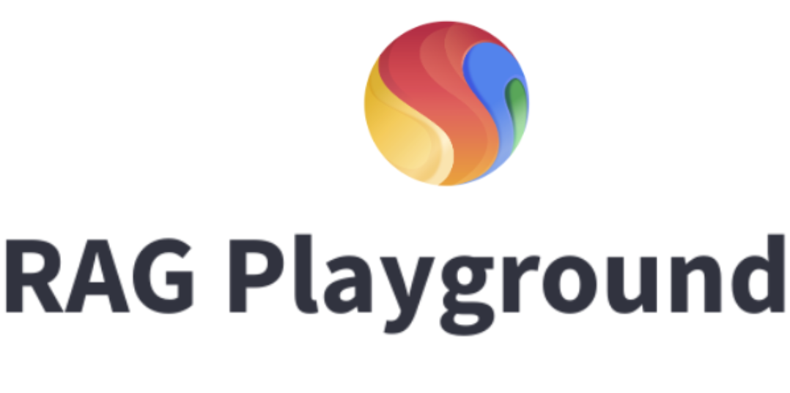

# Google Cloud Applied AI Engineering

Welcome to the Google Cloud Applied AI Engineering repository. This repository contains reference guides, blueprints, code samples, and hands-on labs developed by the Google Cloud Applied AI Engineering team.

## Applied AI Engineering: Catalog

* **[Generative AI on Vertex AI](./genai-on-vertex-ai/README.md)**: This section contains code samples and hands-on labs demonstrating the use of [Generative AI models and tools in Vertex AI](https://cloud.google.com/vertex-ai/docs/generative-ai/learn/overview).

<table>

  <tr>
    <th style="text-align: center;">Foundation Models</th>
    <th style="text-align: center;">Evaluation</th>
    <th style="text-align: center;">RAG & Grounding</th>
    <th style="text-align: center;">Agents</th>
    <th style="text-align: center;">Others</th>
  </tr>
  <tr>
    <td style="vertical-align: baseline;">
      <ul>
        <li><a href="./genai-on-vertex-ai/gemini/prompting_recipes/">Gemini Prompting Recipes</a></li>
        <li><a href="./genai-on-vertex-ai/advanced_prompting_training/">Advanced Prompting</a></li>
        <li><a href="./genai-on-vertex-ai/vertex_foundation_tuning/">Foundation model tuning</a></li>
      </ul>
    </td>
    <td style="vertical-align: baseline;">
      <ul>
        <li><a href="./genai-on-vertex-ai/vertex_evaluation_services/">Vertex GenAI Evaluation</a></li>
        <li><a href="./genai-on-vertex-ai/gemini/evals_playbook/">Gemini Evals Playbook</a></li>
      </ul>
    </td>
    <td style="vertical-align: baseline;">
      <ul>
        <li><a href="./genai-on-vertex-ai/vertex_ai_search/">Vertex AI Search</a></li>
        <li><a href="./genai-on-vertex-ai/retrieval_augmented_generation/">Retrieval Augmented Generation</a></li>
      </ul>
    </td>
    <td style="vertical-align: baseline;">
      <ul>
        <li><a href="./genai-on-vertex-ai/agents/">Agents</a></li>
        <li><a href="./genai-on-vertex-ai/vertex_ai_extensions/">Vertex AI Extensions</a></li>
      </ul>
    </td>
    <td style="vertical-align: baseline;">
      <ul>
        <li><a href="./genai-on-vertex-ai/developer_productivity_with_genai/">Developer Productivity with GenAI</a></li>
      </ul>
    </td>
  </tr>

</table>

* **[Google Cloud AI/ML infrastructure](./ai-infrastructure/README.md)**: Reference guides and blueprints that compile best practices, and prescriptive guidance for running large-scale AI/ML workloads on Google Cloud AI/ML infrastructure.

* **[Research Operationalization](./research-operationalization/)**: Code samples demonstrating operationalization of latest research models or frameworks from Google DeepMind and Research teams on Google Cloud including Vertex AI.

In addition to code samples in this repo, you may want to check out the following solutions published by Google Cloud Applied AI Engineering.

<table>

  <tr>
    <th style="text-align: center;">Solution</th>
    <th style="text-align: center;">Description</th>
  </tr>
  <tr>
    <td style="text-align: center;">
      
       
      <a href="https://github.com/GoogleCloudPlatform/Open_Data_QnA">Open Data Q&A</a>
    </td>
    <td>
      The Open Data QnA python solution enables you to chat with your databases by leveraging LLM Agents on Google Cloud. The solution enables a conversational approach to interact with your data by implementing state-of-the-art NL2SQL / Text2SQL methods.
    </td>
  </tr>

  <tr>
    <td style="text-align: center;">
      
       
      <a href="https://github.com/GoogleCloudPlatform/genai-for-marketing">GenAI for Marketing</a>
    </td>
    <td>
      Showcasing Google Cloud's generative AI for marketing scenarios via application frontend, backend, and detailed, step-by-step guidance for setting up and utilizing generative AI tools, including examples of their use in crafting marketing materials like blog posts and social media content, nl2sql analysis, and campaign personalization.
    </td>
  </tr>

  <tr>
    <td style="text-align: center;">
      
       
      <a href="https://github.com/GoogleCloudPlatform/customer-experience-modernization">GenAI for Customer Experience Modernization</a>
    </td>
    <td>
      This solution shows how customers can have modern, engaging interactions with brands, and companies can improve the end user, agent, and customer experiences with a modern customer service platform on Google Cloud. 
    </td>
  </tr>

  <tr>
    <td style="text-align: center;">
      
       
      <a href="https://github.com/GoogleCloudPlatform/vertex-ai-creative-studio">Creative Studio | Vertex AI</a>
    </td>
    <td>
      Creative Studio is a Vertex AI generative media example user experience to highlight the use of Imagen and other generative media APIs on Google Cloud.
    </td>
  </tr>

  <tr>
    <td style="text-align: center;">
      
       
      <a href="https://github.com/GoogleCloudPlatform/applied-ai-engineering-samples/tree/rag-playground">RAG Playground</a>
    </td>
    <td>
      RAG Playground is a platform to experiment with RAG (Retrieval Augmented Generation) techniques. It integrates with LangChain and Vertex AI, allowing you to compare different retrieval methods and/or LLMs on your own datasets. This helps you build, refine, and evaluate RAG-based applications. 
    </td>
  </tr>

</table>

## Getting help

If you have any questions or if you found any problems with this repository, please report through GitHub issues.

## Disclaimer

This is not an officially supported Google product. The code in this repository is for demonstrative purposes only.