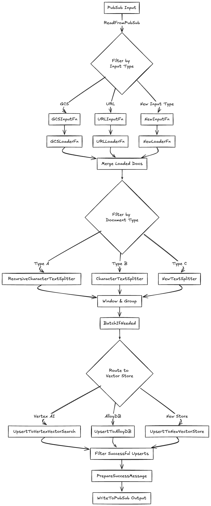

# RAG Playground

RAG Playground is a platform to experiment with RAG (Retrieval Augmented Generation) techniques. It integrates with LangChain and Vertex AI, allowing you to compare different retrieval methods and/or LLMs on your own datasets. This helps you build, refine, and evaluate RAG-based applications.

## 🔗 **Quick Links** <a name="quick-links"></a>

- [RAG Playground](#rag-playground)
  - [🔗 **Quick Links** ](#-quick-links-)
  - [📍 **Overview** ](#-overview-)
  - [📦 **Features** ](#-features-)
  - [📂 **Repository Structure** ](#-repository-structure-)
  - [🏗️ **Architecture** ](#️-architecture-)
  - [🔄 **Data Processing Pipeline** ](#-data-processing-pipeline-)
    - [**Ingestion Message Schema:**](#ingestion-message-schema)
  - [🖥️ **Serving Layer** ](#️-serving-layer-)
  - [Setup](#setup)
  - [🚀 **Getting Started** ](#-getting-started-)
    - [⚙️ **Initial Setup** ](#️-initial-setup-)
    - [🤖 **Running Locally** ](#-running-locally-)
  - [🚀 **Deployment** ](#-deployment-)
  - [🤝 **Contributing** ](#-contributing-)
  - [👏 **Acknowledgments** ](#-acknowledgments-)

## 📍 **Overview** <a name="overview"></a>

RAG Playground is a tool / framework that aims to solve the following high level goals:

1. Provide a unified interface to experiment with various RAG components and configurations (parsing, chunking, retrieval, answering, etc.).
2. Enable easy comparison of answers generated by various techniques for the same query.
3. Provide automated side-by-side evaluations using first-party and third-party frameworks (e.g., Vertex GenAI Rapid Evals). Includes a voting system to gather user preferences and create a "gold standard" dataset for evaluation.
4. Leverage the generated "gold standard" dataset for evaluating new RAG techniques.
5. Leverage user preferences to select the best technique for specific queries. Utilize these preferences to fine-tune LLMs using reinforcement learning with human feedback (RLHF).
6. Easily extensible toolkit extending across any RAG system, component, or evaluation method. Out-of-the-box support starting with Vertex AI Search and DIY RAG APIs.


## 📦 **Features** <a name="features"></a>

| Feature                    | Description                                                                                                                    |
| -------------------------- | ------------------------------------------------------------------------------------------------------------------------------ |
| ✨ Flexible Data Ingestion | Index data from URLs, Google Cloud Storage (GCS), or pre-indexed datasets.                                                    |
| 🔎 Multiple Retrieval Methods | Compare Top-K, Multi-Query Retriever, and Contextual Compression Retriever and more.                                                    |
| 🧠 LLM Integration       | Utilize different Vertex AI LLM models for answer generation and contextual compression.                                        |
| 📊 Evaluation             | Evaluate answer quality using Vertex AI's evaluation metrics and user feedback, including automated and human-in-the-loop evaluations. |
| 🖥️ Streamlit Frontend     | Intuitive UI for querying, configuring experiments, visualizing results, and providing user feedback.                         |
| ☁️ Scalable Deployment | Deploy backend services as serverless on Cloud Functions for scalability, cost-efficiency, and ease of management.                            |
| 🔄 Data Processing Pipeline | Modular and scalable data ingestion and processing pipeline built with Apache Beam running on Cloud Dataflow (Apache Beam). Supports different data loaders, splitters, and vector stores. |
| ⚙️ Orchestration | Flexible experiment configuration and management with Cloud Workflows, to orchestrate concurrent and parallel execution of RAG tasks.                 |

## 📂 **Repository Structure** <a name="repository-structure"></a>

```
└── backend
    ├── answer_generation_service/          # Answer Generation Cloud Function
    ├── answer_evaluation_service/          # Evaluation Service Cloud Function
    ├── pubsub_trigger_service/             # Pub/Sub Trigger Service Cloud Function
    ├── models/                             # Data models
    ├── routers/                            # FastAPI routers
    ├── utils/                              # Utility modules
    ├── workflows/                          # Cloud Workflow definition
    ├── dataflow/                           # Dataflow pipeline
    ├── firebase_setup.py                   # Setting up Firebase
    ├── main.py                             # Main FastAPI entrypoint
    ├── Dockerfile                          # Dockerfile to launch API backend
    └── requirements.txt                    # Python dependencies for backend
└── frontend
    ├── pages/                              # Streamlit front-end pages
    ├── app.py                              # Main Streamlit application
└── config.toml                             # Configuration
└── requirements.txt                        # Python dependencies
```

## 🏗️ **Architecture** <a name="architecture"></a>


> RAG Playground adopts a microservices architecture built with Cloud Functions, Cloud Workflows, Firebase, and Cloud Dataflow along with Vertex AI to create a scalable and robust platform. The frontend, built with Streamlit, interacts with the backend through API calls, initiating a series of services responsible for data processing, answer generation, and evaluation.

**High-Level Components:**

- **Frontend (Streamlit):** Provides an intuitive user interface for:
    - Configuring data sources and preprocessing options.
    - Defining RAG experiments with different retrieval methods, LLMs, and evaluation metrics.
    - Submitting queries and visualizing answers generated by various RAG pipelines.
    - Providing user feedback on answer quality.
- **Backend (FastAPI):**  Serves as the central API gateway and orchestrates the backend services.
- **Data Processing Pipeline (Apache Beam):**  Handles data ingestion, preprocessing, and indexing. It features a modular design with support for various:
    - Data Loaders (e.g., load from Cloud Storage buckets, URLs).
    - Document Splitters (e.g., Recursive character text splitter).
    - Embedding Models (e.g., Gecko embedding models on Vertex AI).
    - Vector Stores (e.g., Vertex AI Vector Search).
- **Experiment Orchestrator (Cloud Workflows):** Manages the execution of RAG experiments defined by the user. It leverages Cloud Workflows to orchestrate the following services:
    - **Answer Generation Service (Cloud Function):**  Retrieves relevant documents from the vector store and generates answers using the specified LLM.
    - **Answer Evaluation Service (Cloud Function):** Evaluates the generated answers using automated metrics (e.g., Vertex GenAI Rapid Evals) and user feedback.


## 🔄 **Data Processing Pipeline** <a name="data-processing-pipeline"></a>


The Data Processing Pipeline is responsible for ingesting, preprocessing, and indexing your data for efficient retrieval. The pipeline is built with Apache Beam, and run on Cloud Dataflow providing scalability and fault tolerance.

**Key Stages:**

1. **Data Input and Loading:** Supports various data loaders via LangChain, allowing you to ingest data from sources like Cloud Storage or URLs. 
2. **Data Splitting:**  Utilizes LangChain splitters to divide documents into smaller chunks for embedding and indexing.
3. **Batching Documents:** Groups document chunks into mini-batches to optimize upsertion to the vector store.
4. **Upsert to Vector Store:**  Supports various vector stores via LangChain, including Vertex AI Vector Search. It manages index creation and upsertion automatically.


### **Ingestion Message Schema:**

The pipeline consumes messages from Pub/Sub with the following schema:

```json
{
   "input":{
      "type":"gcs",
      "config":{
         "project_name":"",
         "bucket_name":"",
         "prefix":""
      }
   },
   "data_loader":{
      "type":"document_ai",
      "config":{
         "project_id":"",
         "location":"us",
         "processor_name":"",
         "gcs_output_path":""
      }
   },
   "document_splitter":{
      "type":"recursive_character",
      "config":{
         "chunk_size":1000,
         "chunk_overlap":200
      }
   },
   "vector_store":{
      "type":"vertex_ai",
      "config":{
         "project_id":"",
         "region":"",
         "index_id":"",
         "endpoint_id":"",
         "embedding_model":"text-embedding-004",
         "index_name":"unique_index_name"
      }
   }
}
```

## 🖥️ **Serving Layer** <a name="serving-layer"></a>

The Serving Layer handles query processing, answer generation, and evaluation.

**Experiment Orchestrator:**

- The frontend allows users to define RAG experiments by selecting retrieval methods, LLMs, and evaluation metrics.
- The backend translates user selections into a set of tasks representing different combinations of parameters.
- Cloud Workflows orchestrates the execution of these tasks, invoking the Answer Generation and Evaluation Services.

**Experiment Runner Workflow:**

- **Answer Generation Service (Cloud Function):**
    - Retrieves relevant documents based on the chosen retrieval method and the user's query.
    - Generates an answer using the specified LLM and its parameters.
- **Answer Evaluation Service (Cloud Function):**
    - Evaluates the generated answer using automated metrics (Vertex AI Rapid Eval) and collects user feedback.


## Setup
## 🚀 **Getting Started** <a name="getting-started"></a>

### ⚙️ **Initial Setup** <a name="initial-setup"></a>

**Prerequisites:**

- Google Cloud Project with billing enabled.
- Python 3.9 or higher.

1. **Clone the repository:**

   ```bash
   git clone https://github.com/GoogleCloudPlaform/rag-playground.git
   cd rag-playground
   ```
2. **Modify Environment Variables**
   - Navigate to `env.vars` and set the `PROJECT_ID` to your GCP project ID.
   - [Optional] Modify the other variables in `env.vars` to your liking.

3. **[OPTIONAL] Setup GCP Project:**
   -  You may need to do some/all of the following in case you are running on a new GCP project:
      * Create default VPC network (as automatic)
      * Enable CloudBuild API and grant the CloudBuild Service Account the following roles on the project:
        * `roles/logging.LogWriter`
        * `roles/iam.securityAdmin`
        * `roles/cloudfunctions.developer`
        * `roles/firebase.admin`

4. **Run the Build**

   ```bash
   gcloud builds submit --config cloudbuild.yaml
   ```

5. **[OPTIONAL] Destroy Resources**

   ```bash
   gcloud builds submit --config cloudbuild-destroy.yaml
   ```

## 🤝 **Contributing** <a name="contributing"></a>

Contributions are welcome! Please open an issue or submit a pull request if you have any suggestions or bug fixes.

## 👏 **Acknowledgments** <a name="acknowledgments"></a>
