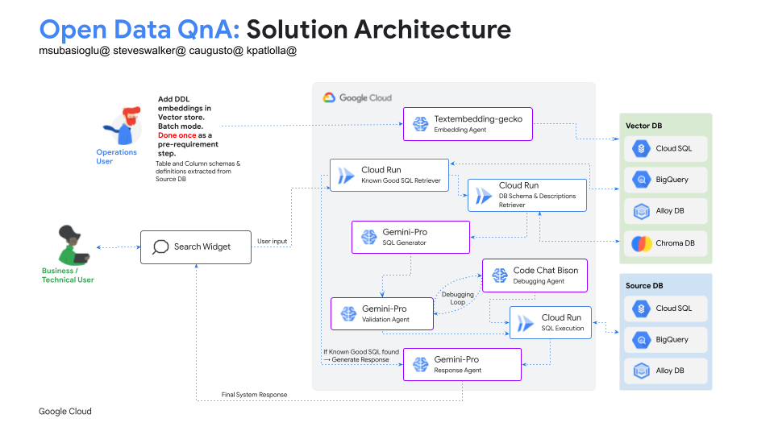

<p align="center">
    <a href="utilities/imgs/aaie.png">
        
    </a>
</p>
<p align="center">
    <a href="https://sites.google.com/corp/google.com/genai-solutions/home?authuser=0">
        
    </a>
</p>
<h1 align="center">Open Data QnA - Chat with your SQL Database</h1> 

Overview
-------------
The **Open Data QnA** python library enables you to chat with your databases by leveraging LLM Agents on Google Cloud.
It is built on a modular design and currently supports the following components: 

### Database Connectors
* **Google Cloud SQL for PostgreSQL**
* **Google BigQuery**

### Vector Stores 
* **PGVector on Google Cloud SQL for PostgreSQL**
* **BigQuery Vector Store**
* **ChromaDB (WIP)**

### Agents 
* **BuildSQLAgent:** the BuildSQLAgent uses an LLM to generate a SQL query based on the users' natural language question, as well as the table and column schemas.
* **ValidateSQLAgent:** the ValidateSQLAgent, if enabled, fetches the result of the BuildSQLAgent and analyzes if the SQL is valid. 
* **DebugSQLAgent:** the DebugSQLAgent, if enabled, takes the BuildSQLAgent's response and fixes it iteratively in X rounds, if the initial response was not valid. 
* **ResponseAgent:** the ResponseAgent utilizes the users' natural language question along with the result of the final SQL run to generate an answer in natural language. 
* **VisualizeAgent:** the VisualizeAgent generates two google charts (suggested by LLM) code based on the inputs of SQL, User Question and SQL Results to display on web UI (Javascript)

**Note:** the library was formerly named Talk2Data. You may still find artifacts with the old naming in this repository. 

Architecture
-------------
<p align="center">
    <a href="utilities/imgs/Open Data QnA Solution Architecture.png">
        
    </a>
</p>

Solution Overview
-------------
<p align="center">
    <a href="utilities/imgs/Open Data QnA Solution Overview.png">
        
    </a>
</p>


Repository Structure 
-------------

```
.
├── agents
  └── __init__.py
  └── core.py
  └── BuildSQLAgent.py
  └── DebugSQLAgent.py
  └── EmbedderAgent.py
  └── ResponseAgent.py
  └── ValidateSQLAgent.py
  └── VisualizeAgent.py
└── dbconnectors
  └── __init__.py
  └── core.py
  └── PgConnector.py
  └── BQConnector.py
└── embeddings
  └── __init__.py
  └── retrieve_embeddings.py
  └── store_embeddings.py
  └──kgq_embeddings.py
└── frontend
└── notebooks
  └── 0_CopyDataToBigQuery.ipynb
  └── 0_CopyDataToBigQuery.ipynb
  └── 1_SetUpVectorStore.ipynb
  └── 2_RunOpenDataQnA.ipynb
  └── 3_LoadKnownGoodSQL.ipynb
└── scripts
  └── bq_to_pg.py
  └── cache_known_sql.py
  └── known_good_sql.csv
└── utilities
  └── __init__.py
  └── policy.yaml
└── Dockerfile
└── main.py
└── pyproject.toml
└── config.ini
```

- [`/agents`](/agents): Source code for the LLM Agents.  
- [`/dbconnectors`](/dbconnectors): Source code for backend APIs.
- [`/embeddings`](/embeddings): Source code for creating and storing embeddings.
  - [`/retrieve_embeddings.py`](/embeddings/retrieve_embeddings.py): Source code for retrieving table schema and embedding creation. 
  - [`/store_embeddings.py`](/embeddings/store_embeddings.py): Source code for storing table schema embeddings in Vector Store.
  - [`/kgq_embeddings.py`](/embeddings/kgq_embeddings.py): Source code for loading good sqls and creating embeddings in the Vector Store) 
- [`/notebooks`](/notebooks): Sample notebooks demonstrating the usage of this library.  
- [`/scripts`](/scripts): Additional scripts for initial setup.
  - [`/bq_to_pg.py`](/scripts/bq_to_pg.py): Source code for exporting BigQuery tables to PostgreSQL on Google Cloud SQL. 
  - [`/cache_known_sql.py`](/scripts/cache_known_sql.py): Source code for storing known working question-SQL pairs in PostgreSQL.
  - [`/known_good_sql.csv`](/scripts/known_good_sql.csv): CSV files containing known working question-SQL pairs. 
- [`/Dockerfile`](/Dockerfile) : This Dockerfile is used to deploy endpoints required for the Demo UI we have under [`/frontend`](/frontend)
- [`/main.py`](/main.py) : Flask-based API code to deploy various endpoints for the Demo UI under [`/frontend`](/frontend)
- [`/frontend`](/frontend) : Angular based frontend code to deploy demo app using the API developed with [`/main.py`](/main.py)


    
### 1. Clone the repository and switch to the correct branch 
   
    git clone git@github.com:GoogleCloudPlatform/applied-ai-engineering-samples.git
    cd applied-ai-engineering-samples 
    git checkout opendataqna 


### 2. Run the [Vector Store Setup Notebook](/notebooks/1_SetUpVectorStore.ipynb)

   If your IDE doesn't have Jupyter+Python extensions, when you try changing the kernel it will prompt you to install the same. Please go ahead and install.
.   
   Follow the instructions in the notebook

   
### 3. Run the [OpenDataQnA Notebook](/notebooks/2_RunOpenDataQnA.ipynb)

   Don't forget to switch your notebook kernel to the newly generated .venv environment after running the poetry command similarly as above.

### 4. [Loading Known Good SQL Examples](/notebooks/2_RunOpenDataQnA.ipynb)
   
   In case you want to separately load Known Good SQLs please run this notebook once the config variables are setup in config.ini file. This can be run multiple times just to load the known good sql queries and create embeddings for it.


### 5. Create Endpoints

   Here we are going to create publicly accessible endpoints (no authentication) .

   If you're working on a managed GCP project, it is common that there would be Domain Restricted Sharing Org Policies that will not allow the creation of a public facing endpoint.

   So we can allow all the domains and re-enable the same policy so that we don’t change the existing policy.

   Please run the below command before proceeding ahead. You need to have Organization Policy Admin rights to run the below commands.

```
export PROJECT_ID=<PROJECT_ID>

gcloud resource-manager org-policies set-policy --project=$PROJECT_ID utilities/policy.yaml #This command will create policy that overrides to allow all domain

```

Create the service account and add roles to run the solution backend for the APIs

```
gcloud iam service-accounts create opendataqna
gcloud projects add-iam-policy-binding $PROJECT_ID --member=serviceAccount:opendataqna@$PROJECT_ID.iam.gserviceaccount.com --role='roles/cloudsql.client' --quiet
gcloud projects add-iam-policy-binding $PROJECT_ID --member=serviceAccount:opendataqna@$PROJECT_ID.iam.gserviceaccount.com --role='roles/bigquery.admin' --quiet
gcloud projects add-iam-policy-binding $PROJECT_ID --member=serviceAccount:opendataqna@$PROJECT_ID.iam.gserviceaccount.com --role='roles/aiplatform.user' --quiet

```


**Technologies**

* **Programming language:** Python
* **Framework:** Flask

**Before you start :** Ensure all variables in your config.ini file are correct, especially those for your Postgres instance and BigQuery dataset. If you need to change the Postgres instance or BigQuery dataset values, update the config.ini file before proceeding.   


   The endpoints deployed here are completely customized for the UI built in this demo solution. Feel free to customize the endpoint if needed for different UI/frontend. The gcloud run deploy command create a cloud build that uses the Dockerfile in the OpenDataQnA folder
    
  ***Deploy endpoints to Cloud Run***
```
 cd applied-ai-engineering-samples
 git checkout opendataqna 

 gcloud auth login
 
 export PROJECT_ID=<PROJECT_ID>

 gcloud config set project $PROJECT_ID

 gcloud run deploy <<NAME OF THE INSTANCE>> --region <<REGION>> --source . --service-account=opendataqna@$PROJECT_ID.iam.gserviceaccount.com --min-instances=1   #if you are deploying cloud run application for the first time in the project you will be prompted for a couple of settings. Go ahead and type Yes.


```

   Once the deployment is done successfully you should be able to see the Service URL (endpoint point) link as shown below. Please keep this handy to add this in the frontend or you can get this uri from the cloud run page in the GCP Console. e.g. *https://OpenDataQnA-aeiouAEI-uc.a.run.app*

   Test if the endpoints are working with below command. This should return the dataset your created in the source env setup notebook.
```
 curl <URI of the end point>/available_databases

```


<p align="center">
    <a href="utilities/imgs/Cloud Run Deploy.png">
        
    </a>
</p>


  Delete the Org Policy on the Project that's created above. Do not run this if you haven’t created the org policy above

```
gcloud resource-manager org-policies delete iam.allowedPolicyMemberDomains --project=$PROJECT_ID
```


**API Details**

   All the payloads are in JSON format

1. List Databases : Get the available databases in the vector store that solution can run against

    URI: {Service URL}/available_databases 
    Complete URL Sample : https://OpenDataQnA-aeiouAEI-uc.a.run.app/available_databases

    Method: GET

    Request Payload : NONE

    Request response:
    ```
    {
    "Error": "",
    "KnownDB": "[{\"table_schema\":\"imdb-postgres\"},{\"table_schema\":\"retail-postgres\"}]",
    "ResponseCode": 200
    }
    ```

2. Known SQL : Get suggestive questions (previously asked/examples added) for selected database

    URI: /get_known_sql
    Complete URL Sample : https://OpenDataQnA-aeiouAEI-uc.a.run.app/get_known_sql   

    Method: POST

    Request Payload :

    ```
    {
    "user_database":"retail"
    }
    ```

    Request response:

    ```
    {
    "Error": "",
    "KnownSQL": "[{\"example_user_question\":\"Which city had maximum number of sales and what was the count?\",\"example_generated_sql\":\"select st.city_id, count(st.city_id) as city_sales_count from retail.sales as s join retail.stores as st on s.id_store = st.id_store group by st.city_id order by city_sales_count desc limit 1;\"}]",
    "ResponseCode": 200
    }
    ```


3. SQL Generation : Generate the SQL for the input question asked aganist a database

    URI: /generate_sql


    Method: POST

    Complete URL Sample : https://OpenDataQnA-aeiouAEI-uc.a.run.app/get_known_sql


    Request payload:

    ```
    {
    "user_question":"Which city had maximum number of sales?",
    "user_database":"retail"
    }
    ```


    Request response:
    ```
    {
    "Error": "",
    "GeneratedSQL": " select st.city_id from retail.sales as s join retail.stores as st on s.id_store = st.id_store group by st.city_id order by count(*) desc limit 1;",
    "ResponseCode": 200
    }
    ```


4. Execute SQL : Run the SQL statement against provided database source

    URI:/run_query
    Complete URL Sample : https://OpenDataQnA-aeiouAEI-uc.a.run.app/run_query

    Method: POST

    Request payload:
    ```
    { "user_database": "retail",
    "generated_sql":"select st.city_id from retail.sales as s join retail.stores as st on s.id_store = st.id_store group by st.city_id order by count(*) desc limit 1;"
    }
    ```

    Request response:
    ```
    {
    "Error": "",
    "KnownDB": "[{\"city_id\":\"C014\"}]",
    "ResponseCode": 200
    }
    ```
5. Embedd SQL : To embed known good SQLs to your example embeddings

    URI:/embed_sql
    Complete URL Sample : https://OpenDataQnA-aeiouAEI-uc.a.run.app/embed_sql

    METHOD: POST

    Request Payload:

    ```
    {
    "user_question":"Which city had maximum number of sales?",
    "generated_sql":"select st.city_id from retail.sales as s join retail.stores as st on s.id_store = st.id_store group by st.city_id order by count(*) desc limit 1;",
    "user_database":"retail"
    }
    ```

    Request response:
    ```
    {
    "ResponseCode" : 201, 
    "Message" : "Example SQL has been accepted for embedding",
    "Error":""
    }
    ```
6. Generate Visualization Code : To generated javascript Google Charts code based on the SQL Results and display them on the UI

    As per design we have two visualizations suggested showing up when the user clicks the visualize button. Hence two divs are send as part of the response “chart_div”, “chart_div_1” to bind them to that element in the UI
        

    If you are only looking to setup enpoint you can stop here. In case you require the demo app (frontend UI) built in the solution, proceed to the next step.

    URI:/generate_viz
    Complete URL Sample : https://OpenDataQnA-aeiouAEI-uc.a.run.app/generate_viz
    
    METHOD: POST

    Request Payload:
    ```
      {
      "user_question": "What are top 5 product skus that are ordered?",
      "sql_generated": "SELECT productSKU as ProductSKUCode, sum(total_ordered) as TotalOrderedItems FROM `inbq1-joonix.demo.sales_sku` group by productSKU order by sum(total_ordered) desc limit 5",
      "sql_results": [
        {
          "ProductSKUCode": "GGOEGOAQ012899",
          "TotalOrderedItems": 456
        },
        {
          "ProductSKUCode": "GGOEGDHC074099",
          "TotalOrderedItems": 334
        },
        {
          "ProductSKUCode": "GGOEGOCB017499",
          "TotalOrderedItems": 319
        },
        {
          "ProductSKUCode": "GGOEGOCC077999",
          "TotalOrderedItems": 290
        },
        {
          "ProductSKUCode": "GGOEGFYQ016599",
          "TotalOrderedItems": 253
        }
      ]
    }
    
    ```

    Request response:
    ```
    {
    "Error": "",
    "GeneratedChartjs": {
        "chart_div": "google.charts.load('current', {\n  packages: ['corechart']\n});\ngoogle.charts.setOnLoadCallback(drawChart);\n\nfunction drawChart() {\n  var data = google.visualization.arrayToDataTable([\n    ['Product SKU', 'Total Ordered Items'],\n    ['GGOEGOAQ012899', 456],\n    ['GGOEGDHC074099', 334],\n    ['GGOEGOCB017499', 319],\n    ['GGOEGOCC077999', 290],\n    ['GGOEGFYQ016599', 253],\n  ]);\n\n  var options = {\n    title: 'Top 5 Product SKUs Ordered',\n    width: 600,\n    height: 300,\n    hAxis: {\n      textStyle: {\n        fontSize: 12\n      }\n    },\n    vAxis: {\n      textStyle: {\n        fontSize: 12\n      }\n    },\n    legend: {\n      textStyle: {\n        fontSize: 12\n      }\n    },\n    bar: {\n      groupWidth: '50%'\n    }\n  };\n\n  var chart = new google.visualization.BarChart(document.getElementById('chart_div'));\n\n  chart.draw(data, options);\n}\n",
        
        "chart_div_1": "google.charts.load('current', {'packages':['corechart']});\ngoogle.charts.setOnLoadCallback(drawChart);\nfunction drawChart() {\n  var data = google.visualization.arrayToDataTable([\n    ['ProductSKUCode', 'TotalOrderedItems'],\n    ['GGOEGOAQ012899', 456],\n    ['GGOEGDHC074099', 334],\n    ['GGOEGOCB017499', 319],\n    ['GGOEGOCC077999', 290],\n    ['GGOEGFYQ016599', 253]\n  ]);\n\n  var options = {\n    title: 'Top 5 Product SKUs that are Ordered',\n    width: 600,\n    height: 300,\n    hAxis: {\n      textStyle: {\n        fontSize: 5\n      }\n    },\n    vAxis: {\n      textStyle: {\n        fontSize: 5\n      }\n    },\n    legend: {\n      textStyle: {\n        fontSize: 10\n      }\n    },\n    bar: {\n      groupWidth: \"60%\"\n    }\n  };\n\n  var chart = new google.visualization.ColumnChart(document.getElementById('chart_div_1'));\n\n  chart.draw(data, options);\n}\n"
    },
    "ResponseCode": 200
    }

    ```


### 7. Deploy Frontend UI

**Technologies and Components**

* **Framework:** Angular
* **Hosting Platform:** Firebase

**Note** : This UI demo doesn't configure any domain restrictions. If you choose to build one refer to this link https://firebase.google.com/docs/functions/auth-blocking-events?gen=2nd#only_allowing_registration_from_a_specific_domain

1. Install the firebase tools to run CLI commands
    ```
    cd applied-ai-engineering-samples

    npm install -g firebase-tools


    ```


2. Build the firebase community builder image

    Cloud Build provides a Firebase community builder image that you can use to invoke firebase commands in Cloud Build. To use this builder in a Cloud Build config file, you must first build the image and push it to the Container Registry in your project.

    **Note**:*Please complete the steps carely and use the same project which you are going to host the app*

    Follow detailed instructions:
    
    1. Navigate to your project root directory.
    2. Clone the cloud-builders-community repository:

    ```
    git clone https://github.com/GoogleCloudPlatform/cloud-builders-community.git
    ```
    3. Navigate to the firebase builder image:

    ```
    cd cloud-builders-community/firebase 
    ```
    4. Submit the builder to your project, where REGION is one of the supported build regions: 

    ```
    gcloud builds submit --region=REGION .
    ```

    5. Navigate back to your project root directory:
    
    ```
    cd ../..
    ```
 
    6. Remove the repository from your root directory:
    ```
    rm -rf cloud-builders-community/
    ```


4. Configure Firebase

    Login into firebase console (https://console.firebase.google.com/) and create project “Add existing GCP project” select your GCP project that you are using for the deployment of firebase. 

    Choose pay as you go plan and turn off Google Analytics and create.

    Once you added the project to firebase navigate and select your project

   * Navigate to Project Settings > General

   * Add App and select Web

   * Fill the details e.g. Nickname : opendataqna and just register the app

   * Once done continue back the general page and you should see the app

   * Add the linked firebase project as the same that your initialize firebase for hosting (same as the selected)

   * Copy the config object you will use in your app code in the later step


    <p align="center">
        <a href="utilities/imgs/Firebase Config .png">
            
        </a>
    </p>


    * Navigate to Build>Authentication

    * Under Sign-in Method add provider as Google


4. Initialize Firebase

    ```
    cd applied-ai-engineering-samples

    cd frontend

    firebase login --no-localhost

    firebase init hosting 

    ```

    * firebase login --reauth --no-localhost # this command can be used re authenticate in case of authentication errors

    * Use the down arrow to select the option Use an existing project

    * For the public directory prompt provide >> /dist/frontend/browser
    
    * Rewrite all URLs to index prompt enter >> Yes (Enter No for any other options)

    * You should now see firebase.json created in the folder 


5. Update the Config Object and Endpoint URLs for the frontend

    In the file [`/frontend/src/assets/constants.ts`](/frontend/src/assets/constants.ts) replace the config object with the one you copied in the above step and replace the ENDPOINT_OPENDATAQNA with the Service URL from the Endpoint Deployment section above.

    ***Note that these variables need to be exported using "export" keyword. So make sure export is mentioned for both the variables***

    <p align="center">
        <a href="utilities/imgs/constants update.png">
            
        </a>
    </p>

6. Deploy the app

    Setup IAM permissions for the cloudbuild service account to deploy

    * Open the IAM page in the Google Cloud console

    * Select your project and click Open.

    * In the permissions table, locate the email ending with @cloudbuild.gserviceaccount.com, and click on the pencil icon. This is the Cloud Build service account. (If you cannot find it check the box on the top right of permissions list which say Include Google-provided role grants)

    * Add Cloud Build Service Account, Firebase Admin and API Keys Admin roles.

    * Click Save.

    
    Run the below commands on the terminal

    ```
    gcloud services enable firebase.googleapis.com # Enable firebase management API

    cd applied-ai-engineering-samples
    git checkout opendataqna
    cd frontend

    gcloud builds submit . --config frontend.yaml --substitutions _FIREBASE_PROJECT_ID=<PROJECT_ID>

    ```
    


    You can see the app URL at the end of successful deployment

    > Once deployed login if your Google Account > Select Business User > Select a database in the dropdown (top right) > Type in the Query > Hit Query

    A successful SQL generated will be show as below

    <p align="center">
        <a href="utilities/imgs/App generate sql .png">
            
        </a>
    </p>

    Hit on Result and then Visualize to see the results and charts as below

    <p align="center">
        <a href="utilities/imgs/App Result and Viz.png">
            
        </a>
    </p>


Documentation
-------------

* [Open Data QnA Source Code (GitHub)](<https://github.com/GoogleCloudPlatform/applied-ai-engineering-samples/tree/opendataqna>)
* [Open Data QnA usage notebooks](/notebooks)


Quotas and limits
------------------

[BigQuery quotas](<https://cloud.google.com/bigquery/quotas>) including hardware, software, and network components.


License
-------

Open Data QnA is distributed with the [Apache-2.0 license](<LICENSE>).

It also contains code derived from the following third-party packages:

* [pandas](<https://pandas.pydata.org/>)
* [Python](<https://www.python.org/>)

For details, see the [third_party](<X>) directory.


Getting Help
----------

If you have any questions or if you found any problems with this repository, please report through GitHub issues.
