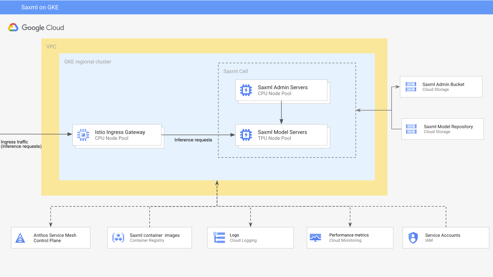

# Saxml on Google Kubernetes Engine 

This reference guide compiles prescriptive guidance for deploying and operating the [Saxml inference system](https://github.com/google/saxml) on [Google Kubernetes Engine](https://cloud.google.com/kubernetes-engine). It also provides comprehensive examples of serving and performance testing of large Generative AI models, such as the Llama2 series.

## High level architecture  

The diagram below illustrates the high-level architecture of the Saxml system on Google Kubernetes Engine.




- The foundation of the environment is a standard, regional, VPC-native GKE cluster with two types of node pools: TPU v4/v5e node pools and CPU node pools.
- TPU node pools host **Saxml Model Servers**.
- A dedicated fixed size CPU node pool hosts **Saxml Admin Servers**. 
- A dedicated autoscaling CPU node pool hosts **Saxml HTTP Proxy** instances. **Saxml HTTP Proxy** is a custom API server that encapsulates **Saxml Client API** and exposes it through REST interfaces.
- A couple of autoscaling CPU node pools are used to deploy auxiliary workloads like checkpoint converter jobs, load generation tooling, and saxutil CLI. These node pools have different node hardware configurations to support various workloads.
- GKE nodes are configured to a use a custom service account
- The cluster is configured to support [Workload Identity](https://cloud.google.com/kubernetes-engine/docs/concepts/workload-identity).
- [Cloud Logging](https://cloud.google.com/logging?hl=en) and [Cloud Monitoring](https://cloud.google.com/monitoring?hl=en) are used for logs and metrics management
- Custom docker images are managed in [Artifact Registry](https://cloud.google.com/artifact-registry)
- If deployed, Load generation tooling  is integrated with [Pubsub](https://cloud.google.com/pubsub?hl=en) and [Big Query](https://cloud.google.com/bigquery) for load testing metrics tracking and analysis

 

## Setup

The deployment process is divided into 2 stages:

1. Base infrastructure: In this stage, the core infrastructure components are configured, including a VPC, a GKE cluster, service accounts, and storage buckets. Optionally, Pubsub and BigQuery services can also be installed to support performance testing management. The deployment process provides the flexibility to use existing VPCs and service accounts, aligning with common IT governance structures in enterprises.

2. Saxml Deployment: In this stage, Saxml servers and utilities are deployed to the GKE cluster.

The deployment process is automated using [Cloud Build](https://cloud.google.com/build), [Terraform](https://cloud.google.com/docs/terraform),  [Kustomize](https://kustomize.io/), and [Skaffold](https://skaffold.dev/). 
To run the setup and execute code samples, you will need a workstation with [Google Cloud SDK](https://cloud.google.com/sdk/docs/install-sdk), [Terraform](https://www.terraform.io/), [Kustomize](https://kubectl.docs.kubernetes.io/installation/kustomize), [Skaffold](https://skaffold.dev), and [kubectl](https://cloud.google.com/kubernetes-engine/docs/how-to/cluster-access-for-kubectl) utilities. We recommend using [Cloud Shell](https://cloud.google.com/shell/docs/using-cloud-shell), which has all the utilities pre-installed.


The first stage is automated with **Cloud Build** and **Terraform**. The **Cloud Build** configuration orchestrates the following steps:

- [ ] Creates a network, a subnet, and IP ranges for GKE pods and services.
- [ ] Creates a VPC-native cluster.
- [ ] Creates CPU node pools.
- [ ] Creates TPU node pools.
- [ ] Creates an IAM service account for Workload Identity and an IAM service account to be used as a custom node pool service account.
- [ ] Configures the cluster for Workload Identity.
- [ ] Creates a Kubernetes namespace to host Saxml servers and a Kubernetes service account to use with Workload Identity
- [ ] Creates two Google Cloud Storage buckets. One to be used as a Saxml admin bucket. The other to manage serving checkpoints and other serving artifacts.
- [ ] Creates an Artifact Registry
- [ ] Creates a BigQuery dataset and table 
- [ ] Creates a Pubsub topic and BigQuery subscription

The last three steps are optional. They can be skipped by setting the `create_artifact_registry` and the `create_perf_testing_infrastructure` Terraform input variables to `false`. Refer to the below instructions on updating Terraform input variables.

The Terraform configuration creates and configures a new VPC  by default. However, you can also opt to use an existing VPC for a GKE cluster, as this functionality is supported by the [gke-aiml Terraform module](../terraform-modules/gke-aiml/README.md), which is used by the Terraform configuration.

To use an existing VPC you need to modify the inputs to the `module "base_environment"` in the `environment/1-base-infrastrucutre/main.tf` file, following the instructions in the [gke-aiml Terraform module documentation](../terraform-modules/gke-aiml/README.md) 

In the second stage, the Saxml components, including admin servers, model servers, and http proxies are deployed to the GKE cluster. This stage is automated with **Skaffold** and **Kustomize**. 


> [!WARNING]
>  Your project must have sufficient [quota to provision TPU resources](https://cloud.google.com/tpu/docs/quota). Else, you can [request for a higher quota limit](https://cloud.google.com/docs/quota/view-manage#requesting_higher_quota).


### Configure pre-requisites

Before proceeding with the environment deployment stages, you must:

- Create a new Google Cloud project or select an existing one.
- Enable the necessary services.
- Configure an automation service account and an automation Google Cloud storage bucket.


The following services are required by the base environment:
- `cloudbuild.googleapis.com`
- `artifactregistry.googleapis.com`
- `cloudkms.googleapis.com`
- `cloudresourcemanager.googleapis.com`
- `container.googleapis.com`
- `compute.googleapis.com`
- `container.googleapis.com`
- `iam.googleapis.com`
- `iamcredentials.googleapis.com`
- `serviceusage.googleapis.com`
- `stackdriver.googleapis.com`
- `storage-component.googleapis.com`
- `storage.googleapis.com`
- `sts.googleapis.com`

The following additional services are required if you deploy the performance testing components:
- `bigquery.googleapis.com`
- `pubsub.googleapis.com`

You also need a GCS bucket that will be used for managing Terraform state and other Terraform artifacts and a service account that will be impersonated by Terraform when provisioning the environment. The service account should have the following project level roles:
- `iam.securityAdmin`
- `iam.serviceAccountAdmin`
- `compute.networkAdmin`
- `container.admin`
- `iam.serviceAccountUser`
- `storage.admin`
- `artifactregistry.admin`

If the performance testing components are being deployed additional roles are required:
- `pubsub.editor`
- `bigquery.admin`


If you lack administrative-level permissions to enable GCP services or to create and configure service accounts in your project, your project administrator must perform these tasks. However, if you are a project owner, you can enable the services and create and configure the automation service account as part of the [Configure automation settings](#configure-automation-settings) step.


#### Configure automation settings 

During this step, Terraform is configured to utilize the specified automation bucket and service account. Optionally, you can also enable the necessary services and create both the automation service account and the automation bucket.


1. Clone this repo
2. Change the current folder to [environment/0-bootstrap](environment/0-bootstrap/)
3. Copy the [terraform.tfvars.tmpl](environment/0-bootstrap/terraform.tfvars.tmpl) file to `terraform.tfvars`
4. Modify the `terraform.tfvars` file to reflect your environment
  - `project_id` - your project ID
  - `deletion_protection` - Set to `true` to protect you cluster and GCS buckets from accidental deletion by Terraform apply/destroy commands. Unless this field is set to false, a terraform destroy or terraform apply that would delete the cluster or non-empty GCS buckets will fail.
  - `create_automation_bucket` - set to `true` if you want to create a new automation bucket; set to `false` if you want to use an existing bucket
  - `automation_bucket` - the name and location of a bucket you want to use for automation. If you use an existing bucket the `location` field will be ignored
  - `create_automation_sa` - set to `true` if you want to create a new automation service account; set to `false` if you want to use an existing service account
  - `automation_sa_name` - the name of an automation service account to be used by Terraform for impersonation
  - `enable_apis` - set to `true` if you want to enable the services listed in the `services` variable
  - `services` - the list of services to enable in your project
  - `roles` - the list of roles to assign to an automation services account. These roles will only be assigned to a newly created account. If you are using an existing account, this list will be ignored.
5. Execute the `terraform init` command
6. Execute the `terraform apply` command

The Terraform configuration generates prepopulated template and `.tfvars` files for configuring the Terraform backend and providers, which can be utilized in the following setup stages. These template files are stored in the `gs://<YOUR-AUTOMATION-BUCKET/providers` and `gs://<YOUR-AUTOMATION-BUCKET/tfvars` folders. 


#### Granting Cloud Build impersonating rights

To be able to impersonate the automation service account, the Cloud Build service account needs to have the `iam.serviceAccountTokenCreator` rights on the automation service account.

```shell
AUTOMATION_SERVICE_ACCOUNT=<AUTOMATTION_SERVICE_ACOUNT_EMAIL>
CLOUD_BUILD_SERVICE_ACCOUNT=<PROJECT_NUMBER>@cloudbuild.gserviceaccount.com

gcloud iam service-accounts add-iam-policy-binding $AUTOMATION_SERVICE_ACCOUNT --member="serviceAccount:$CLOUD_BUILD_SERVICE_ACCOUNT" --role='roles/iam.serviceAccountTokenCreator'
```

Replace <PROJECT_NUMBER> with your project number. Replace <AUTOMATION_SERVICE_ACCOUNT_EMAIL> with the email of your automation service account. 

### Deploy base infrastructure 

#### Clone the GitHub repo. 

If you haven't already, please clone this repository now.

```bash
git clone https://github.com/GoogleCloudPlatform/applied-ai-engineering-samples.git
```

Change the current directory, to [environment](environment/).

#### Configure build parameters

To configure the Terraform steps in the build, copy the [terraform.tfvars.tmpl](environment/1-base-infrastructure/terraform.tfvars.tmpl) template file in the [1-base-infrastructure](environment/1-base-infrastructure/) folder to `terraform.tfvars`. Make modifications to the `terraform.tfvars` file to align it with your specific environment. At the very least, you should set the following variables:

- `project_id` - your project ID
- `region` - your region for a VPC and a GKE cluster
- `prefix` - the prefix that will be added to the default names of resources provisioned by the configuration
- `tpu_node_pools` - The  template shows an example configuration for one TPU node pool with a single `v5litepod-4` slice. Modify the `tpu_node_pools` variable to provision different TPU node pool configurations, as described below.
- `cpu_node_pools` - The template shows an example configuration for a number of CPU node pools as outlined in the [High Level Architecture section](#high-level-architecture)  
- `create_artifact_registry` - set to `true` to create a new artifact registry
- `create_performance_testing_infrastructure` - set to `true` if you want to provision and configure Pubsub and BigQuery resources to support tracking and managing performance metrics.

If you wish to modify other default settings, such as the default name suffixes for a cluster or GCS bucket names, you can override the defaults specified in the [variables.tf](environment/1-base-infrastructure/variables.tf) file within your `terraform.tfvars` file.

When configuring TPU node pools, ensure that you set the TPU type to one of the following values:

##### TPU types


| TPU type name | TPU chip|  Slice type | Slice topology | TPU VM type | Number of VMs in a slice | Number of chips in a VM |
| ------------- | ---------| -----------|----------------|-------------|--------------------------| ------------------------|
|v5litepod-1| tpuv5e| tpu-v5-lite-podslice|1x1|ct5lp-hightpu-1t|1|1|
|v5litepod-4|tpuv5e|tpu-v5-lite-podslice|2x2|ct5lp-hightpu-4t|1|4|
|v5litepod-8|tpuv5e|tpu-v5-lite-podslice|2x4|ct5lp-hightpu-8t|1|8|
|v5litepod-16|tpuv5e|tpu-v5-lite-podslice|4x4|ct5lp-hightpu-4t|4|4|
|v5litepod-32|tpuv5e|tpu-v5-lite-podslice|4x8|ct5lp-hightpu-4t|8|4|
|v5litepod-64|tpuv5e|tpu-v5-lite-podslice|8x8|ct5lp-hightpu-4t|16|4|
|v5litepod-128|tpuv5e|tpu-v5-lite-podslice|8x16|ct5lp-hightpu-4t|32|4|
|v5litepod-256|tpuv5e|tpu-v5-lite-podslice|16x16|ct5lp-hightpu-4t|64|4|

----------

#### Submit the build

To initiate the build, execute the following command from the [environment](environment/) folder:

```
export PROJECT_ID=<PROJECT_ID>
export AUTOMATION_BUCKET=<YOUR_AUTOMATION_BUCKET>
export ENV_NAME=<TF_STATE_FOLDER> 

gcloud builds submit \
  --project $PROJECT_ID \
  --config cloudbuild.provision.yaml \
  --timeout "2h" \
  --substitutions=_AUTOMATION_BUCKET=$AUTOMATION_BUCKET,_ENV_NAME=$ENV_NAME \
  --machine-type=e2-highcpu-32 
```

Replace the following values:
- `<PROJECT_ID>` with your project ID
- `<YOUR_AUTOMATION_BUCKET>` with your automation bucket
- `<ENV_NAME>` with the name of the folder within your automation bucket where Terraform state and other artifacts will be managed


To track the progress of the build, you can either follow the link displayed in Cloud Shell or visit the Cloud Build page on the [Google Cloud Console](https://console.cloud.google.com/cloud-build).


### Deploy Saxml components 

Once the base infrastructure has been provisioned, you can proceed to deploy Saxml components on your GKE cluster. This deployment process has been automated using [Skaffold](https://skaffold.dev) and [Kustomize](https://kustomize.io). You'll find the manifests, source code, and other deployment artifacts in the [environment/2-workloads/saxml](environment/2-workloads/saxml/) folder.

#### Update Kustomize settings

From the [environment/2-workloads/saxml/manifests](environment/2-workloads/saxml/manifests/) folder:

```
kustomize edit set namespace <NAMESPACE>
```

Replace `<NAMESPACE>` with the name of the namespace established during the base infrastructure setup. Remember that you can retrieve the names of all the provisioned resources, including the namespace name, from the build logs.

Copy the [parameters.env.tmpl](environment/2-workloads/saxml/manifests/parameters.env.tmpl) file to `parameters.env`.

Update the `parameters.env` to reflect your desired configuration

- `GSBUCKET` - the name of the Saxml admint bucket.
- `KSA` - the Kubernetes service account to use for Workload Identity. 
- `SAX_CELL` - the name of the Sax cell. Currently, it is hardcoded to `/sax/test`.
- `SAX_ROOT` - the path in the Saxml admin bucket to the root folder. Update the bucket name with the name of your admin bucket - `GSBUCKET`
- `TPU_CHIP` - the TPU chip type  
- `TPU_SLICE_TYPE` - the TPU pod slice type
- `TPU_SLICE_TOPOLOGY` - the topology of the TPU slice
- `CHIPS_PER_NODE` - the number of TPU chips on the host node

You can find the values for `TPU_CHIP`, `TPU_SLICE_TYPE`, `TPU_SLICE_TOPOLOGY`, and `CHIPS_PER_NODE` in your configuration by referring to the [TPU types table](#tpu-types).

#### Get cluster credentials

Set credentials to access your GKE cluster. 

```
gcloud container clusters get-credentials <CLUSTER_NAME> --region <REGION>
```

Replace `<CLUSTER_NAME>` with the name of your GKE cluster and `<REGION>` with the region of your GKE cluster.

#### Deploy Saxml 

To build and push the container packaging the Saxml proxy to your Artifact Registry, and to deploy Saxml components, execute the following command from the [environment/2-workloads/saxml](environment/2-workloads/saxml/) folder:


```
skaffold run --default-repo <ARTIFACT_REGISTRY_PATH> --profile cloudbuild
```

Replace `<ARTIFACT_REGISTRY>` with the path to your Artifact Registry. 

Verify that all pods have started successfully:

```
kubectl get pods -n <SAXML_NAMESPACE>
```


#### Undeploy Saxml

If you wish to undeploy the Saxml components, run the following command from the [environment/2-workloads/saxml](environment/2-workloads/saxml/) folder:

```
skaffold delete
```

### Deploying Saxml models

This repository contains comprehensive examples for deploying and performance testing various Generative AI models, including Llama2, 7B, 13B, and 70B. For detailed instructions, please refer to the [Examples section](/ai-infrastructure/saxml-on-gke/examples/README.md) of the repository.

### Destroying the environment

#### Base infrastructure

From the [environment](environment/) folder.

```

export PROJECT_ID=<PROJECT_ID>
export AUTOMATION_BUCKET=<YOUR_AUTOMATION_BUCKET>
export ENV_NAME=<TF_STATE_FOLDER>

gcloud builds submit \
  --project $PROJECT_ID \
  --config cloudbuild.destroy.yaml \
  --substitutions _AUTOMATION_BUCKET=$AUTOMATION_BUCKET,_ENV_NAME=$ENV_NAME \
  --timeout "2h" \
  --machine-type=e2-highcpu-32 
```


#### Bootstrap

To clean up the automation bootstrap resources.

From the [environment](environment/0-bootstrap/) folder:

```
terraform destroy
```


