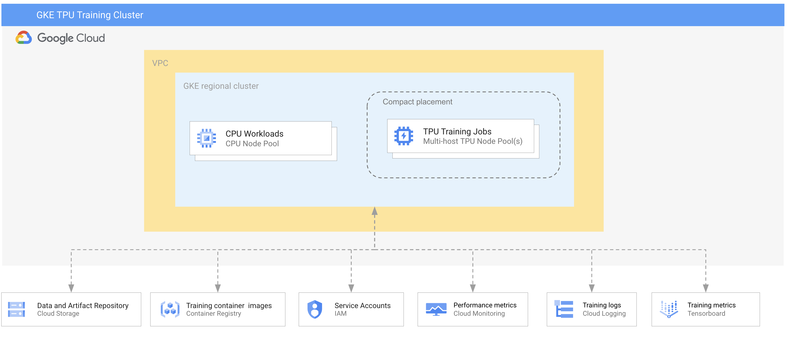
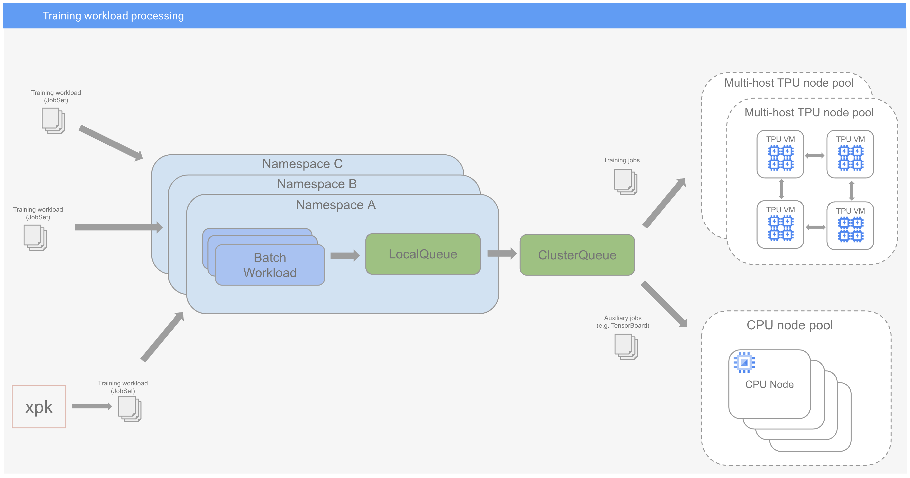

#  Running TPU training workloads on GKE

This reference guide compiles best practices, prescriptive guidance, and code samples for running large-scale machine learning training workloads with [TPU v4, TPU v5p, and TPU v5e on Google Kubernetes Engine (GKE)](https://cloud.google.com/tpu/docs/tpus-in-gke).

The guide covers two main topics:
- **Configuring a GKE based environment for large scale training on Cloud TPUs**
  - This section describes how to configure a GKE cluster to optimize it for running large-scale machine learning training workloads on [Cloud TPUs](https://cloud.google.com/tpu).
- **Defining, Submitting, and Monitoring Training Jobs**
  - This section provides guidance on how to define, submit, and manage training jobs using the Kubernetes [JobSet](https://github.com/kubernetes-sigs/jobset) and [Kueue](https://github.com/kubernetes-sigs/kueue) APIs.


## Architecture of the training environment

The diagram below depicts a high-level architecture of the training environment.




The foundation of the environment is a regional, VPC-native GKE cluster. The cluster has two types of node pools: 
- A single node pool with CPU-only nodes and 
- Several [TPU node pools](https://cloud.google.com/kubernetes-engine/docs/concepts/tpus)

This cluster topology supports running both [single-slice and multislice TPU](https://cloud.google.com/tpu/docs/multislice-introduction) training jobs.

Following are the components supporting the environment:

- [Cloud Storage](https://cloud.google.com/storage) buckets for saving training datasets and artifacts produced by training jobs (such as logs and checkpoints)
- [Cloud Artifact Registry](https://cloud.google.com/artifact-registry) for packaging and managing the training, data processing, and other components of a training workload as Docker container images.
- [Vertex AI TensorBoard](https://cloud.google.com/vertex-ai/docs/experiments/tensorboard-introduction) for tracking and visualizing training metrics.
- [Cloud Monitoring](https://cloud.google.com/monitoring) for collecting and analyzing non-functional performance metrics
- [Cloud Logging](https://cloud.google.com/logging) for managing logs produced by training workloads.
- Training workloads [impersonate an Identity and Access Management (IAM) service accounts](https://cloud.google.com/iam/docs/service-account-impersonation) to access Google Cloud services, such as Cloud Storage and Vertex AI TensorBoard.


## Training workload processing 

The following diagram illustrates the process of submitting and processing training workloads in the training environment.



In this guide we advocate using the [Kubernetes JobSet API](https://github.com/kubernetes-sigs/jobset) as the preferred method of coordinating large-scale distributed machine learning training workloads on Kubernetes. When combined with the [Kubernetes Kueue](https://github.com/kubernetes-sigs/kueue) job queuing API, it provides flexible and comprehensive training job orchestration.

The training environment's **Kueue** configuration  consists of a single [ClusterQueue](https://kueue.sigs.k8s.io/docs/concepts/cluster_queue/) and multiple [LocalQueues](https://kueue.sigs.k8s.io/docs/concepts/local_queue/). This topology provides basic multi-tenancy and supports managing and prioritizing jobs submitted by multiple teams.

All training workloads are represented as JobSet resources. A JobSet resource may contain multiple job types, such as a core distributed training job and an auxiliary job that manages TensorBoard logs and other artifacts generated by the training job.

JobSet workloads are submitted to a namespaced LocalQueue that points to a ClusterQueue. As illustrated in the diagram, in our reference implementation, there is a single cluster queue.

Kueue monitors when resources (such as TPU slices) required by a workload (JobSet) are available, and then decides when to admit the workload and how to allocate the workload's components to the cluster's node pools. 

For example, a training workload can contain two types of jobs:
- A multislice distributed training job
- A job that uploads TensorBoard logs generated by the training job to Vertex AI TensorBoard

When all the resources required by this workload become available, the training job's workers are started on the requested number of TPU slices. The TensorBoard uploader is started on one of the nodes in the CPU node pool.

If the compute resources required by other submitted workloads are not available, these workloads are queued and scheduled for admission based on the priorities that have been defined in the Kueue configuration.

To submit a JobSet-defined workload, you need to create a YAML JobSet resource definition. There are a few different ways to do this. In this guide, we demonstrate two approaches:
- Using [Kustomize](https://kustomize.io/), which helps you create YAML JobSet resource definitions directly.
- Using  [xpk](https://github.com/google/maxtext/tree/main/xpk), which provides an easy-to-use Python-based CLI.


## Setup 

The deployment process is automated using [Cloud Build](https://cloud.google.com/build), [Terraform](https://cloud.google.com/docs/terraform), and [Kustomize](https://kustomize.io/). The Cloud Build configuration file  defines two deployment stages:


In the first stage a Terraform configuration is applied, which:

- [ ] Creates a network, a subnet, and IP ranges for GKE pods and services.
- [ ] Creates a VPC-native cluster.
- [ ] Creates a node pool with nodes equipped with CPUs only.
- [ ] Creates a specified number of TPU node pools.
- [ ] Creates an IAM service account for Workload Identity and an IAM service account to be used as a custom node pool service account.
- [ ] Configures the cluster for Workload Identity.
- [ ] Creates a Google Cloud Storage bucket.
- [ ] Creates a Vertex TensorBoard instance
- [ ] Creates an Artifact Registry

In the second stage, the [JobSet](https://github.com/kubernetes-sigs/jobset) and [Kueue](https://kueue.sigs.k8s.io/docs/concepts/cluster_queue/) custom resources are installed and Kueue is configured as described in the previous section. 


> [!WARNING]
>  Your project must have sufficient [quota to provision TPU resources](https://cloud.google.com/tpu/docs/quota). Else, you can [request for a higher quota limit](https://cloud.google.com/docs/quota/view-manage#requesting_higher_quota).


### Configure pre-requisites

Before submitting the Cloud Build build, you need to:

- [ ] Create a new Google Cloud project or select an existing one.
- [ ] Enable the necessary services.
- [ ] Configure an automation service account and an automation Google Cloud storage bucket.


The following services are required by the base environment:
- `cloudbuild.googleapis.com`
- `artifactregistry.googleapis.com`
- `cloudkms.googleapis.com`
- `cloudresourcemanager.googleapis.com`
- `container.googleapis.com`
- `compute.googleapis.com`
- `container.googleapis.com`
- `iam.googleapis.com`
- `iamcredentials.googleapis.com`
- `serviceusage.googleapis.com`
- `stackdriver.googleapis.com`
- `storage-component.googleapis.com`
- `storage.googleapis.com`
- `sts.googleapis.com`
- `aiplatform.googleapis.com`

You also need a GCS bucket that will be used for managing Terraform state and other Terraform artifacts and a service account that will be impersonated by Terraform when provisioning the environment. The service account should have the following project level roles:
- `iam.securityAdmin`
- `iam.serviceAccountAdmin`
- `compute.networkAdmin`
- `container.admin`
- `iam.serviceAccountUser`
- `storage.admin`
- `artifactregistry.admin`
- `aiplatform.user`

If you lack administrative-level permissions to enable GCP services or to create and configure service accounts in your project, your project administrator must perform these tasks. However, if you are a project owner, you can enable the services and create and configure the automation service account as part of the [Configure automation settings](#configure-automation-settings) step.


#### Configure automation settings 

During this step, Terraform is configured to utilize the specified automation bucket and service account. Optionally, if configured, it can also enable the necessary services and create both the automation service account and the automation bucket.


1. Clone this repo
2. Change the current folder to [environment/0-bootstrap](environment/0-bootstrap/)
3. Copy the [terraform.tfvars.tmpl](environment/0-bootstrap/terraform.tfvars.tmpl) file to `terraform.tfvars`
4. Modify the `terraform.tfvars` file to reflect your environment
  - `project_id` - your project ID
  - `deletion_protection` - Set to `true` to protect you cluster and GCS buckets from accidental deletion by Terraform apply/destroy commands. Unless this field is set to false, a terraform destroy or terraform apply that would delete the cluster or non-empty GCS buckets will fail.
  - `create_automation_bucket` - set to `true` if you want to create a new automation bucket; set to `false` if you want to use an existing bucket
  - `automation_bucket` - the name and location of a bucket you want to use for automation. If you use an existing bucket the `location` field will be ignored
  - `create_automation_sa` - set to `true` if you want to create a new automation service account; set to `false` if you want to use an existing service account
  - `automation_sa_name` - the name of an automation service account to be used by Terraform for impersonation
  - `enable_apis` - set to `true` if you want to enable the services listed in the `services` variable
  - `services` - the list of services to enable in your project
  - `roles` - the list of roles to assign to an automation services account. These roles will only be assigned to a newly created account. If you are using an existing account, this list will be ignored.
5. Execute the `terraform init` command
6. Execute the `terraform apply` command

The Terraform configuration generates prepopulated template files for configuring the Terraform backend and providers, which can be utilized in the following setup stages. These template files are stored in the `gs://<YOUR-AUTOMATION-BUCKET/providers` and `gs://<YOUR-AUTOMATION-BUCKET/tfvars` folders. 


#### Grant Cloud Build impersonating rights

To be able to impersonate the automation service account, the Cloud Build service account needs to have the `iam.serviceAccountTokenCreator` rights on the automation service account.

```shell
AUTOMATION_SERVICE_ACCOUNT=<AUTOMATTION_SERVICE_ACOUNT_EMAIL>
CLOUD_BUILD_SERVICE_ACCOUNT=<PROJECT_NUMBER>@cloudbuild.gserviceaccount.com

gcloud iam service-accounts add-iam-policy-binding $AUTOMATION_SERVICE_ACCOUNT --member="serviceAccount:$CLOUD_BUILD_SERVICE_ACCOUNT" --role='roles/iam.serviceAccountTokenCreator'
```

Replace <PROJECT_NUMBER> with your project number. Replace <AUTOMATION_SERVICE_ACCOUNT_EMAIL> with the email of your automation service account. If you created the automation service account using the bootstrap Terraform you can retrieve its email by executing the `terraform output automation_sa` command from the `environment\0-bootstrap` folder.


### Deploy 

#### Clone the GitHub repo. 

If you haven't already run the bootstrap stage, please clone this repository now.

```bash
git clone https://github.com/GoogleCloudPlatform/applied-ai-engineering-samples.git
```

Change the current directory, to `ai-infrastructure/tpu-training-on-gke/environment`.

#### Configure build parameters

To configure the Terraform steps in the build, copy the [terraform.tfvars.tmpl](environment/1-base-infrastructure/terraform.tfvars.tmpl) template file in the [1-base-infrastructure](environment/1-base-infrastructure/) folder to `terraform.tfvars`. Make modifications to the `terraform.tfvars` file to align it with your specific environment. At the very least, you should set the following variables:

- `project_id` - your project ID
- `region` - your region for a VPC and a GKE cluster
- `prefix` - the prefix that will be added to the default names of resources provisioned by the configuration
- `tensorboard_config.region` - the region of a TensorBoard instance
- `create_artifact_registry` - set to `true` to create a new artifact registry
- `cpu_node_pools` - The `terraform.tfvars.tmpl` template provides an example configuration for a single autoscaling node pool.  
- `tpu_node_pools` - The  template shows an example configuration for two TPU node pools: one with a single v5e-4 pod slice and the other with a single v5e-16 pod slice. Modify the `tpu_node_pools` variable to provision different TPU node pool configurations, as described below.

If you wish to modify other default settings, such as the default name suffixes for a cluster or GCS bucket names, you can override the defaults specified in the [variables.tf](environment/1-base-infrastructure/variables.tf) file within your `terraform.tfvars` file.

When configuring TPU node pools, ensure that you set the TPU type to one of the following values:

##### TPU types


| TPU type name | Slice type | Slice topology | TPU VM type | Number of VMs in a slice | Number of chips in a VM |
| ------------- | -----------|----------------|-------------|--------------------------| ------------------------|
|v5litepod-4|tpu-v5-lite-podslice|2x2|ct5lp-hightpu-4t|1|4|
|v5litepod-16|tpu-v5-lite-podslice|4x4|ct5lp-hightpu-4t|4|4|
|v5litepod-32|tpu-v5-lite-podslice|4x8|ct5lp-hightpu-4t|8|4|
|v5litepod-64|tpu-v5-lite-podslice|8x8|ct5lp-hightpu-4t|16|4|
|v5litepod-128|tpu-v5-lite-podslice|8x16|ct5lp-hightpu-4t|32|4|
|v5litepod-256|tpu-v5-lite-podslice|16x16|ct5lp-hightpu-4t|64|4|
|v4-8|tpu-v4-podslice|2x2x1|ct4p-hightpu-4t|1|4|
|v4-16|tpu-v4-podslice|2x2x2|ct4p-hightpu-4t|2|4|
|v4-32|tpu-v4-podslice|2x2x4|ct4p-hightpu-4t|4|4|
|v4-64|tpu-v4-podslice|2x4x4|ct4p-hightpu-4t|8|4|
|v4-128|tpu-v4-podslice|4x4x4|ct4p-hightpu-4t|16|4|
|v4-256|tpu-v4-podslice|4x4x8|ct4p-hightpu-4t|32|4|
|v4-512|tpu-v4-podslice|4x8x8|ct4p-hightpu-4t|64|4|
|v4-1024|tpu-v4-podslice|8x8x8|ct4p-hightpu-4t|128|4|
|v4-1536|tpu-v4-podslice|8x8x12|ct4p-hightpu-4t|192|4|
|v4-2048|tpu-v4-podslice|8x8x16|ct4p-hightpu-4t|256|4|
|v4-4096|tpu-v4-podslice|8x16x16|ct4p-hightpu-4t|512|4|
|v5p-8|tpu-v5p-slice|2x2x1|ct5p-hightpu-4t|1|4|
|v5p-16|tpu-v5p-slice|2x2x2|ct5p-hightpu-4t|2|4|
|v5p-32|tpu-v5p-slice|2x2x4|ct5p-hightpu-4t|4|4|
|v5p-64|tpu-v5p-slice|2x4x4|ct5p-hightpu-4t|8|4|
|v5p-128|tpu-v5p-slice|4x4x4|ct5p-hightpu-4t|16|4|
|v5p-256|tpu-v5p-slice|4x4x8|ct5p-hightpu-4t|32|4|
|v5p-384|tpu-v5p-slice|4x4x12|ct5p-hightpu-4t|48|4|
|v5p-512|tpu-v5p-slice|4x8x8|ct5p-hightpu-4t|64|4|
|v5p-640|tpu-v5p-slice|4x4x20|ct5p-hightpu-4t|80|4|
|v5p-768|tpu-v5p-slice|4x8x12|ct5p-hightpu-4t|96|4|
|v5p-896|tpu-v5p-slice|4x4x28|ct5p-hightpu-4t|112|4|
|v5p-1024|tpu-v5p-slice|8x8x8|ct5p-hightpu-4t|128|4|
|v5p-1152|tpu-v5p-slice|4x12x12|ct5p-hightpu-4t|144|4|
|v5p-1280|tpu-v5p-slice|4x8x20|ct5p-hightpu-4t|160|4|
|v5p-1408|tpu-v5p-slice|4x4x44|ct5p-hightpu-4t|176|4|
|v5p-1536|tpu-v5p-slice|8x8x12|ct5p-hightpu-4t|192|4|
|v5p-1664|tpu-v5p-slice|4x4x52|ct5p-hightpu-4t|208|4|
|v5p-1792|tpu-v5p-slice|4x8x28|ct5p-hightpu-4t|224|4|
|v5p-1920|tpu-v5p-slice|4x12x20|ct5p-hightpu-4t|240|4|
|v5p-2048|tpu-v5p-slice|8x8x16|ct5p-hightpu-4t|256|4|
|v5p-2176|tpu-v5p-slice|4x4x68|ct5p-hightpu-4t|272|4|
|v5p-2304|tpu-v5p-slice|8x12x12|ct5p-hightpu-4t|288|4|
|v5p-2432|tpu-v5p-slice|4x4x76|ct5p-hightpu-4t|304|4|
|v5p-2560|tpu-v5p-slice|8x8x20|ct5p-hightpu-4t|320|4|
|v5p-2688|tpu-v5p-slice|4x12x28|ct5p-hightpu-4t|336|4|
|v5p-2816|tpu-v5p-slice|4x8x44|ct5p-hightpu-4t|352|4|
|v5p-2944|tpu-v5p-slice|4x4x92|ct5p-hightpu-4t|368|4|
|v5p-3072|tpu-v5p-slice|4x12x16|ct5p-hightpu-4t|384|4|
|v5p-3200|tpu-v5p-slice|4x20x20|ct5p-hightpu-4t|400|4|
|v5p-3328|tpu-v5p-slice|4x8x52|ct5p-hightpu-4t|416|4|
|v5p-3456|tpu-v5p-slice|12x12x12|ct5p-hightpu-4t|432|4|
|v5p-3584|tpu-v5p-slice|8x8x28|ct5p-hightpu-4t|448|4|
|v5p-3712|tpu-v5p-slice|4x4x116|ct5p-hightpu-4t|464|4|
|v5p-3840|tpu-v5p-slice|8x12x20|ct5p-hightpu-4t|480|4|
|v5p-3968|tpu-v5p-slice|4x4x124|ct5p-hightpu-4t|496|4|
|v5p-4096|tpu-v5p-slice|8x16x16|ct5p-hightpu-4t|512|4|
|v5p-4224|tpu-v5p-slice|4x12x44|ct5p-hightpu-4t|528|4|
|v5p-4352|tpu-v5p-slice|4x8x68|ct5p-hightpu-4t|544|4|
|v5p-4480|tpu-v5p-slice|4x20x28|ct5p-hightpu-4t|560|4|
|v5p-4608|tpu-v5p-slice|12x12x16|ct5p-hightpu-4t|576|4|
|v5p-4736|tpu-v5p-slice|4x4x148|ct5p-hightpu-4t|592|4|
|v5p-4864|tpu-v5p-slice|4x8x76|ct5p-hightpu-4t|608|4|
|v5p-4992|tpu-v5p-slice|4x12x52|ct5p-hightpu-4t|624|4|
|v5p-5120|tpu-v5p-slice|8x16x20|ct5p-hightpu-4t|640|4|
|v5p-5248|tpu-v5p-slice|4x4x164|ct5p-hightpu-4t|656|4|
|v5p-5376|tpu-v5p-slice|8x12x28|ct5p-hightpu-4t|672|4|
|v5p-5504|tpu-v5p-slice|4x4x172|ct5p-hightpu-4t|688|4|
|v5p-5632|tpu-v5p-slice|8x8x44|ct5p-hightpu-4t|704|4|
|v5p-5760|tpu-v5p-slice|12x12x20|ct5p-hightpu-4t|720|4|
|v5p-5888|tpu-v5p-slice|4x8x92|ct5p-hightpu-4t|736|4|
|v5p-6016|tpu-v5p-slice|4x4x188|ct5p-hightpu-4t|752|4|
|v5p-6144|tpu-v5p-slice|12x16x16|ct5p-hightpu-4t|768|4|
|v5p-6272|tpu-v5p-slice|4x28x28|ct5p-hightpu-4t|784|4|
|v5p-6400|tpu-v5p-slice|8x20x20|ct5p-hightpu-4t|800|4|
|v5p-6528|tpu-v5p-slice|4x12x68|ct5p-hightpu-4t|816|4|
|v5p-6656|tpu-v5p-slice|8x8x52|ct5p-hightpu-4t|832|4|
|v5p-6784|tpu-v5p-slice|4x4x212|ct5p-hightpu-4t|848|4|
|v5p-6912|tpu-v5p-slice|12x12x24|ct5p-hightpu-4t|864|4|
|v5p-7040|tpu-v5p-slice|4x20x44|ct5p-hightpu-4t|880|4|
|v5p-7168|tpu-v5p-slice|8x16x28|ct5p-hightpu-4t|896|4|
|v5p-7296|tpu-v5p-slice|4x12x76|ct5p-hightpu-4t|912|4|
|v5p-7424|tpu-v5p-slice|4x8x116|ct5p-hightpu-4t|928|4|
|v5p-7552|tpu-v5p-slice|4x4x236|ct5p-hightpu-4t|944|4|
|v5p-7680|tpu-v5p-slice|12x16x20|ct5p-hightpu-4t|960|4|
|v5p-7808|tpu-v5p-slice|4x4x244|ct5p-hightpu-4t|976|4|
|v5p-7936|tpu-v5p-slice|4x8x124|ct5p-hightpu-4t|992|4|
|v5p-8064|tpu-v5p-slice|12x12x28|ct5p-hightpu-4t|1008|4|
|v5p-8192|tpu-v5p-slice|16x16x16|ct5p-hightpu-4t|1024|4|
|v5p-8320|tpu-v5p-slice|4x20x52|ct5p-hightpu-4t|1040|4|
|v5p-8448|tpu-v5p-slice|8x12x44|ct5p-hightpu-4t|1056|4|
|v5p-8704|tpu-v5p-slice|8x8x68|ct5p-hightpu-4t|1088|4|
|v5p-8832|tpu-v5p-slice|4x12x92|ct5p-hightpu-4t|1104|4|
|v5p-8960|tpu-v5p-slice|8x20x28|ct5p-hightpu-4t|1120|4|
|v5p-9216|tpu-v5p-slice|12x16x24|ct5p-hightpu-4t|1152|4|
|v5p-9472|tpu-v5p-slice|4x8x148|ct5p-hightpu-4t|1184|4|
|v5p-9600|tpu-v5p-slice|12x20x20|ct5p-hightpu-4t|1200|4|
|v5p-9728|tpu-v5p-slice|8x8x76|ct5p-hightpu-4t|1216|4|
|v5p-9856|tpu-v5p-slice|4x28x44|ct5p-hightpu-4t|1232|4|
|v5p-9984|tpu-v5p-slice|8x12x52|ct5p-hightpu-4t|1248|4|
|v5p-10240|tpu-v5p-slice|16x16x20|ct5p-hightpu-4t|1280|4|
|v5p-10368|tpu-v5p-slice|12x12x36|ct5p-hightpu-4t|1296|4|
|v5p-10496|tpu-v5p-slice|4x8x164|ct5p-hightpu-4t|1312|4|
|v5p-10752|tpu-v5p-slice|12x16x28|ct5p-hightpu-4t|1344|4|
|v5p-10880|tpu-v5p-slice|4x20x68|ct5p-hightpu-4t|1360|4|
|v5p-11008|tpu-v5p-slice|4x8x172|ct5p-hightpu-4t|1376|4|
|v5p-11136|tpu-v5p-slice|4x12x116|ct5p-hightpu-4t|1392|4|
|v5p-11264|tpu-v5p-slice|8x16x44|ct5p-hightpu-4t|1408|4|
|v5p-11520|tpu-v5p-slice|12x20x24|ct5p-hightpu-4t|1440|4|
|v5p-11648|tpu-v5p-slice|4x28x52|ct5p-hightpu-4t|1456|4|
|v5p-11776|tpu-v5p-slice|8x8x92|ct5p-hightpu-4t|1472|4|
|v5p-11904|tpu-v5p-slice|4x12x124|ct5p-hightpu-4t|1488|4|
|v5p-12032|tpu-v5p-slice|4x8x188|ct5p-hightpu-4t|1504|4|
|v5p-12160|tpu-v5p-slice|4x20x76|ct5p-hightpu-4t|1520|4|
|v5p-12288|tpu-v5p-slice|16x16x24|ct5p-hightpu-4t|1536|4|
|v5p-13824|tpu-v5p-slice|12x24x24|ct5p-hightpu-4t|1728|4|
|v5p-17920|tpu-v5p-slice|16x20x28|ct5p-hightpu-4t|2240|4|

##### Modify Workload Identity and Kueue configurations

By default the following names and identifiers are used when configuring Workload Identity Federation and Kueue
- The IAM service account for WID - `<prefix>-wid-sa`
- The Kubernetes service account - `wid-ksa`
- The Cluster Queue name - `cluster-queue`
- The Local Queue name - `tpu-training-jobs`
- The Namespace for WID Kubernetes accoutn and Local Queue - `tpu-training`

If you want to change these defaults, create a `terraform.tfvars` file in the `2-gke-config` and override the default values from the [environment/2-gke-config/variables.tf](environment/2-gke-config/variables.tf) file.


#### Submit the build


To initiate the build, execute the following command:

```
export AUTOMATION_BUCKET=<YOUR_AUTOMATION_BUCKET>
export AUTOMATION_ACCOUNT=<YOUR_AUTOMATION_ACCOUNT>
export ENV_NAME=<TF_STATE_FOLDER> 
export JOBSET_API_VERSION=v0.3.0
export KUEUE_API_VERSION=v0.5.3 

gcloud builds submit \
  --config cloudbuild.provision.yaml \
  --substitutions _JOBSET_API_VERSION=$JOBSET_API_VERSION,_KUEUE_API_VERSION=$KUEUE_API_VERSION,_AUTOMATION_BUCKET=$AUTOMATION_BUCKET,_ENV_NAME=$ENV_NAME,_AUTOMATION_ACCOUNT=$AUTOMATION_ACCOUNT \
  --timeout "2h" \
  --machine-type=e2-highcpu-32 
```

Replace the following values:
- `<YOUR_AUTOMATION_BUCKET>` with your automation bucket
- `<YOUR_AUTOMATION_ACCOUNT>` with you automation service account
- `<TF_STATE_FOLDER>` with the name of the folder within your automation bucket where Terraform state and other artifacts will be managed

The examples in this repo have been tested with `v0.4.0` version of the JobSet API and `v0.5.3` version of the Kueue API.


To track the progress of the build, you can either follow the link displayed in Cloud Shell or visit the Cloud Build page on the [Google Cloud Console](https://console.cloud.google.com/cloud-build).


## Training workloads examples

The [`examples`](examples/) folder contains code samples that demonstrate how to configure, submit and manage a number of different training workloads.

> Refer to the [README](examples/README.md) in the `examples` folder for detailed instructions.

## Cleanup Environment 

To destroy the environment and clean up all the provisioned resources:

```bash

export AUTOMATION_BUCKET=<YOUR_AUTOMATION_BUCKET>
export ENV_NAME=<TF_STATE_FOLDER>

gcloud builds submit \
  --config cloudbuild.destroy.yaml \
  --substitutions _AUTOMATION_BUCKET=$AUTOMATION_BUCKET,_ENV_NAME=$ENV_NAME \
  --timeout "2h" \
  --machine-type=e2-highcpu-32 
```


