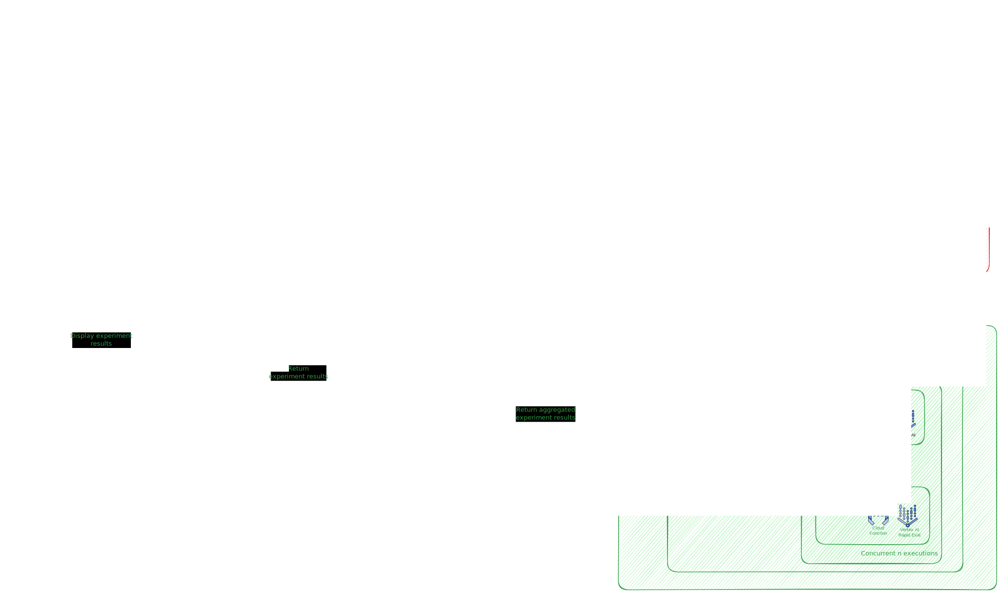

# Architecture

> RAG Playground adopts a microservices architecture built with Cloud Functions, Cloud Workflows, Firebase, and Cloud Dataflow along with Vertex AI to create a scalable and robust platform. The frontend, built with Streamlit, interacts with the backend through API calls, initiating a series of services responsible for data processing, answer generation, and evaluation.

**High-Level Components:**

- **Frontend (Streamlit):** Provides an intuitive user interface for:
    - Configuring data sources and preprocessing options.
    - Defining RAG experiments with different retrieval methods, LLMs, and evaluation metrics.
    - Submitting queries and visualizing answers generated by various RAG pipelines.
    - Providing user feedback on answer quality.
- **Backend (FastAPI):**  Serves as the central API gateway and orchestrates the backend services.
- **Data Processing Pipeline (Apache Beam):**  Handles data ingestion, preprocessing, and indexing. It features a modular design with support for various:
    - Data Loaders (e.g., load from Cloud Storage buckets, URLs).
    - Document Splitters (e.g., Recursive character text splitter).
    - Embedding Models (e.g., Gecko embedding models on Vertex AI).
    - Vector Stores (e.g., Vertex AI Vector Search).
- **Experiment Orchestrator (Cloud Workflows):** Manages the execution of RAG experiments defined by the user. It leverages Cloud Workflows to orchestrate the following services:
    - **Answer Generation Service (Cloud Function):**  Retrieves relevant documents from the vector store and generates answers using the specified LLM.
    - **Answer Evaluation Service (Cloud Function):** Evaluates the generated answers using automated metrics (e.g., Vertex GenAI Rapid Evals) and user feedback.