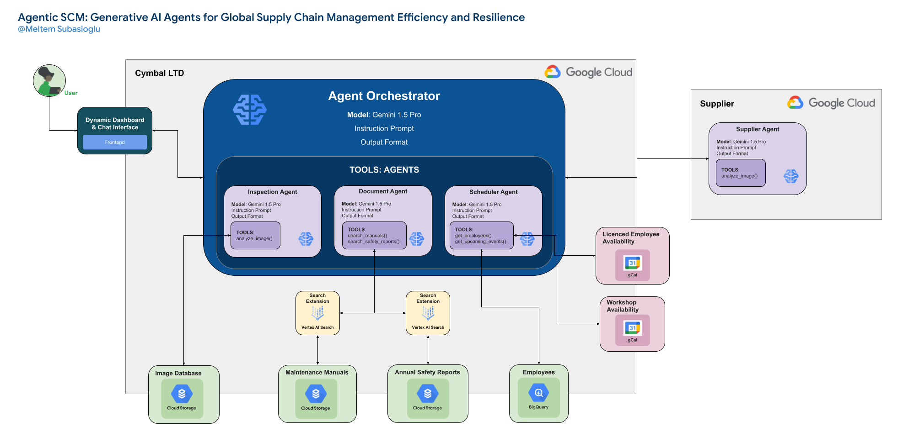

# 🤖 Agentic Supply Chain Maintenance (ASCM)

**ASCM** is an application that leverages Large Language Models (LLMs) and the power of agents to streamline and enhance maintenance and logistics processes within a supply chain context.



## 📂 Repo Structure
Here's a breakdown of the repository's structure:

|Folder/File|Description|
|:---|:---|
|Agents/|Contains the definitions and implementations of all agents.|
|Files/|This folder stores various files, including images, templates, and other resources, serving as a placeholder for data and assets used by the agents.|
|Tools/|Includes utility scripts, helper functions, and external libraries that support the core functionalities of the agents and the application.|
|TL-2000_StingSport.jpg|An image file for testing purposes.|
|main.py|The primary entry point of the ASCM backend application. Good for testing.|
|settings.yaml|A configuration file storing settings and parameters for the application.|
|streamlit_frontend.py|Implements the user interface of the ASCM application using Streamlit.|
|.gitignore|Specifies files and folders to be excluded from version control.|
|session_handler.py|Provides a chat session manager for interacting with Gemini models.|
|tool_instructions.py|Contains functions to return tool instructions based on available tools.|
|agent_definitions.py|Defines the functionalities and behaviors of different agents.|
|core.py|Implements the core functionalities of the agent interactions.|
|orchestrator.py|Defines an orchestrator agent that manages and calls other agents.|
|python_functions.py|Contains various Python functions used by the agents.|
|__init__.py|Marks directories as Python packages.|
|__init__ copy.py|Implements utility functions for running Python functions and managing tool instructions.|


## 🚀 Setup Instructions

1. **Set up a Google Cloud Project:** If you don't already have one, create a Google Cloud project. Make sure billing is enabled.

2. **Enable the Vertex AI API:** Enable the Vertex AI API for your project.

3. **Enable the Google Calendar API:** Enable the Google Calendar API for your project.  This is necessary for scheduling functionalities.

4. **Install Required Libraries:** Create and activate a virtual environment. Then install the required packages from `requirements.txt`:
   ```bash
   pip install -r requirements.txt
   ```

5. **Configure Authentication:** Set up authentication for your Google Cloud project. You can do this using the gcloud command-line tool:

    ```
    gcloud auth application-default login
    ```


6. **Create two Cloud Storage buckets:** one for aircraft manuals and another for safety reports. Replace your-bucket-name with unique names.
    ```
    gsutil mb gs://your-bucket-name-manuals
    gsutil mb gs://your-bucket-name-safety-reports
    ```

Upload your PDF manuals into the your-bucket-name-manuals bucket and your safety reports into the your-bucket-name-safety-reports bucket.

7. **Set up Search Engines:** Create two Search Engines, one for indexing manuals and one for safety reports, following the instructions in the Google Cloud documentation. Note their application IDs.

8. **Set up a Google Calendar:** Create a Google Calendar specifically for scheduling maintenance tasks. Obtain the Calendar ID. This is typically found in the calendar's settings. For the purpose of this application, we will refer to the person who owns the calendar as "John Smith", to use the Google Calendar API.

9. **Configure settings.yaml:** Replace the placeholder values in settings.yaml with your actual configuration details:

    ```
    project_id: "your-project-id"
    location: "your-project-location" #e.g., "us-central1"
    manuals_bucket: "your-bucket-name-manuals"
    safety_reports_bucket: "your-bucket-name-safety-reports"
    app_id_manuals: "your-app-id-manuals"  # Refer to step 7.
    app_id_safety_reports: "your-app-id-safety-reports" # Refer to step 7.
    gcal_api_key: "YOUR_GCAL_API_KEY"  #  Obtain this from the Google Cloud Console.
    johnSmith_gcal_ID: "john.smiths.calendarId" # Replace with John Smith's Google Calendar ID. Refer to step 8.
    ```


10. **Prepare Data:** Load the ```Files/employees.csv``` into a BigQuery table on your GCP project. Put the dataset project, dataset name (e.g. 'ascm') and table name (e.g. employees) in settings.yaml.

11. **Rename settings(template).yaml:** Remove the (template) and rename to ```settings.yaml```.


12. **Run the Application:**

Backend: python main.py
Frontend (Streamlit): streamlit run streamlit_frontend.py


