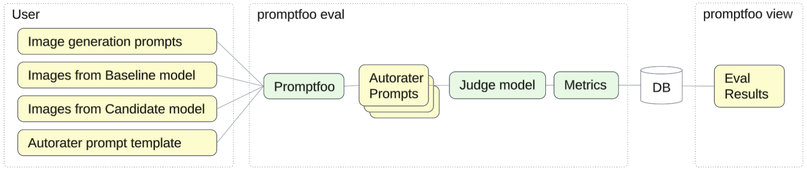

# Image-Prompt Alignment
### _Eval Recipe for model migration_

This Eval Recipe demonstrates how to use a prompt alignment autorater to compare image generation quality of two models (Imagen2 and Imagen3) with the open source evaluation tool [Promptfoo](https://www.promptfoo.dev/).



- Use case: Image Generation

- We use an unlabeled dataset with 5 image generation prompts stored in a JSONL file [`dataset.jsonl`](./dataset.jsonl) and JPEG images generated by Imagen2 and Imagen3 based on these prompts. Each record in the dataset includes 3 attributes wrapped in the `vars` object so that Promptfoo can inject this data into the autorater prompt.
    - `prompt`: full text of the image generation prompt
    - `imagen2`: local path to the JPG image generated by Imagen 2 based on this prompt
    - `imagen3`: local path to the JPG image generated by Imagen 3 based on this prompt

- All instructions for our prompt alignment autorater are stored in [`autorater_instructions.txt`](./autorater_instructions.txt). These instructions are imported into the final multiodal prompt templates [`prompt_imagen2.yaml`](./prompt_imagen2.yaml) and [`prompt_imagen3.yaml`](./prompt_imagen3.yaml) that combine the images from our dataset with the autorater instructions.

- [`promptfooconfig.yaml`](./promptfooconfig.yaml) contains all  configuration:
    - `providers`: defines the LLM judge model
    - `prompts`: autorater prompt templates for Imagen2 and Imagen3
    - `tests`: location of the dataset file
    - `defaultTest`: loads the autorater instructions into the shared variable `autorater_instructions`, and configures the custom prompt alignment metric defined in [`metrics.py`](./metrics.py). This metric parses the JSON response from our autorater and returns the percentage score along with the list of gaps detected by the autorater (each gap describes a prompt requirement that is not satisfied by the image).

## How to run this Eval Recipe

- Google Cloud Shell is the easiest option as it automatically clones our Github repo:

    <a href="https://console.cloud.google.com/cloudshell/open?git_repo=https://github.com/GoogleCloudPlatform/applied-ai-engineering-samples&cloudshell_git_branch=main&cloudshell_workspace=genai-on-vertex-ai/gemini/model_upgrades">
        
    </a>

- Alternatively, you can use the following command to clone this repo to any Linux environment with configured [Google Cloud Environment](https://cloud.google.com/vertex-ai/docs/start/cloud-environment):

    ``` bash
    git clone --filter=blob:none --sparse https://github.com/GoogleCloudPlatform/applied-ai-engineering-samples.git && \
    cd applied-ai-engineering-samples && \
    git sparse-checkout init && \
    git sparse-checkout set genai-on-vertex-ai/gemini/model_upgrades && \
    git pull origin main
    cd genai-on-vertex-ai/gemini/model_upgrades
    ```

1. Install Promptfoo using [these instructions](https://www.promptfoo.dev/docs/installation/).
1. Navigate to the Eval Recipe directory in terminal and run the command `promptfoo eval`.

    ``` bash
    cd image_prompt_alignment/promptfoo
    promptfoo eval
    ```

1. Run `promptfoo view` to analyze the eval results. You can switch the Display option to `Show failures only` in order to investigate any underperforming prompts.

## How to customize this Eval Recipe:
1. Copy the eval recipe folder (`promptfoo`) to your environment.
1. Create a list of image generation prompts.
1. Use your baseline and candidate models to generate images based on the image generation prompts, and save them to the `images` folder.
1. Put your image generation prompts into the dataset file `dataset.jsonl` and make sure that each record points to the right images.
1. That's it! You are ready to run `promptfoo eval` and view the results using `promptfoo view`.