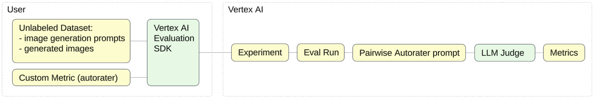

# Image-Prompt Alignment
### _Eval Recipe for model migration_

This Eval Recipe demonstrates how to use a prompt alignment autorater to compare image generation quality of two models (Imagen2 and Imagen3) using [Vertex AI Evaluation Service](https://cloud.google.com/vertex-ai/generative-ai/docs/models/evaluation-overview).



- Use case: Image Generation

- We use a separate unlabeled dataset in JSONL format for each model: [`dataset_imagen2.jsonl`](./dataset_imagen2.jsonl) and [`dataset_imagen3.jsonl`](./dataset_imagen3.jsonl). Each record in these datasets includes 2 attributes:
    - `prompt`: full text of the image generation prompt
    - `image_path`: local path to the JPG image generated based on this prompt

- The autorater instructions are stored in [`autorater_instructions.txt`](./autorater_instructions.txt). These instructions are imported into the multiodal prompt templates [`prompt_imagen2.yaml`](./prompt_imagen2.yaml) and [`prompt_imagen3.yaml`](./prompt_imagen3.yaml) that combine the images from our dataset with the autorater instructions.

- The evaluation is configured in [`eval.py`](./eval.py):
    - `load_dataset`: loads the dataset including the images referenced from the JSONL file.
    - `image_prompt_alignment_autorater`: assembles the autorater prompt and runs inference in order to identify gaps between the prompt and the generated image and calculate the prompt alignment score.
    - `run_eval`: executes evalulation based on one dataset file.
    - `compare_models`: orchestrates evaluations for both models and prints the results.

- Shell script [`run.sh`](./run.sh) installs the required Python libraries and runs `eval.py` 

## How to run this Eval Recipe

- Google Cloud Shell is the easiest option as it automatically clones our Github repo:

    <a href="https://console.cloud.google.com/cloudshell/open?git_repo=https://github.com/GoogleCloudPlatform/applied-ai-engineering-samples&cloudshell_git_branch=main&cloudshell_workspace=genai-on-vertex-ai/gemini/model_upgrades">
        
    </a>

- Alternatively, you can use the following command to clone this repo to any Linux environment with configured [Google Cloud Environment](https://cloud.google.com/vertex-ai/docs/start/cloud-environment):

    ``` bash
    git clone --filter=blob:none --sparse https://github.com/GoogleCloudPlatform/applied-ai-engineering-samples.git && \
    cd applied-ai-engineering-samples && \
    git sparse-checkout init && \
    git sparse-checkout set genai-on-vertex-ai/gemini/model_upgrades && \
    git pull origin main
    cd genai-on-vertex-ai/gemini/model_upgrades
    ```

1. Navigate to the Eval Recipe directory in terminal, set your Google Cloud Project ID and run the shell script `run.sh`.

    ``` bash
    cd image_prompt_alignment/vertex_script
    export PROJECT_ID="[your-project-id]"
    ./run.sh
    ```

1. The resulting metrics will be displayed in the script output.
1. You can use [Vertex AI Experiments](https://console.cloud.google.com/vertex-ai/experiments) to view the history of evaluations for each experiment, including the final scores.

## How to customize this Eval Recipe:

1. Edit the Python script `eval.py`:
    - set the `project` parameter of vertexai.init to your Google Cloud Project ID.
    - configure a unique `experiment_name` for tracking purposes.
    - (optional) you can customize the autorater prompt located in the global variable `_AUTORATER_PROMPT_TEMPLATE`.
1. Replace the contenx of the two JSONL files with your image generation prompts.
1. Replace the generated images located in the `images` folder with images generated based on your prompts.