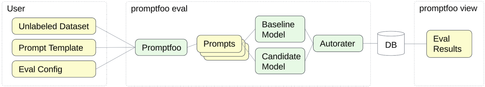

# Multi-Turn Conversation (Chat)
### _Eval Recipe for model migration_

This Eval Recipe demonstrates how to evaluate a multi-turn conversation (chat) on Gemini 1.0 and Gemini 2.0 using the open source evaluation tool [Promptfoo](https://www.promptfoo.dev/).



- Use case: multi-turn conversation

- Evaluation Dataset is based on [Multi-turn Prompts Dataset](https://www.kaggle.com/datasets/softageai/multi-turn-prompts-dataset). It includes 5 conversations: [`dataset.jsonl`](./dataset.jsonl). Each record in this file links to a JSON file with the system instruction followed by a few messages from the User and responses from the Assistant. This dataset does not include any ground truth labels.

- Prompt Template located in [`prompt_template.txt`](./prompt_template.txt) injects the `chat` variable from our dataset which represents the conversation history.

- [`promptfooconfig.yaml`](./promptfooconfig.yaml) contains all Promptfoo configuration:
    - `providers`: list of models that will be evaluated
    - `prompts`: location of the prompt template file
    - `tests`: location of the dataset file
    - `defaultTest`: configures the evaluation metric:
        1. `type: select-best` auto-rater that decides which of the two models configured above generated the best response.
        1. `providers` configures the judge model
        1. `value` configures the custom criteria that is evaluated by the `select-best` auto-rater

## How to run this Eval Recipe

- Google Cloud Shell is the easiest option as it automatically clones our Github repo:

    <a href="https://console.cloud.google.com/cloudshell/open?git_repo=https://github.com/GoogleCloudPlatform/applied-ai-engineering-samples&cloudshell_git_branch=main&cloudshell_workspace=genai-on-vertex-ai/gemini/model_upgrades">
        
    </a>

- Alternatively, you can use the following command to clone this repo to any Linux environment with configured [Google Cloud Environment](https://cloud.google.com/vertex-ai/docs/start/cloud-environment):

    ``` bash
    git clone --filter=blob:none --sparse https://github.com/GoogleCloudPlatform/applied-ai-engineering-samples.git && \
    cd applied-ai-engineering-samples && \
    git sparse-checkout init && \
    git sparse-checkout set genai-on-vertex-ai/gemini/model_upgrades && \
    git pull origin main
    cd genai-on-vertex-ai/gemini/model_upgrades
    ```

1. Install Promptfoo using [these instructions](https://www.promptfoo.dev/docs/installation/).
1. Navigate to the Eval Recipe directory in terminal and run the command `promptfoo eval`.

    ``` bash
    cd multiturn_chat/promptfoo
    promptfoo eval
    ```
    
1. Run `promptfoo view` to analyze the eval results. You can switch the Display option to `Show failures only` in order to investigate any underperforming prompts.

## How to customize this Eval Recipe:
1. Copy the configuration file `promptfooconfig.yaml` to a new folder.
1. Add your labeled dataset file with JSONL schema similar to `dataset.jsonl`. 
1. Save your prompt template to `prompt_template.txt` and make sure that the template variables map to the variables defined in your dataset.
1. That's it! You are ready to run `promptfoo eval`. If needed, add alternative prompt templates or additional metrics to promptfooconfig.yaml as explained [here](https://www.promptfoo.dev/docs/configuration/parameters/).
