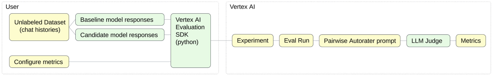

# Multi-turn Chat
### _Eval Recipe for model migration_

This Eval Recipe demonstrates how to compare performance of a Multi-turn conversation (Chat) with Gemini 1.0 and Gemini 2.0 using  [Vertex AI Evaluation Service](https://cloud.google.com/vertex-ai/generative-ai/docs/models/evaluation-overview).



- Use case: multi-turn conversation (Chat)

- Evaluation Dataset is based on [Multi-turn Prompts Dataset](https://www.kaggle.com/datasets/softageai/multi-turn-prompts-dataset). It includes 5 conversations: [`dataset.jsonl`](./dataset.jsonl). Each record in this file links to a JSON file with the conversation history between the User and the Model. This dataset does not include any ground truth labels.

- Python script [`eval.py`](./eval.py) executes the evaluation:
    - `load_dataset`: loads all conversation histories to a Pandas Dataframe.
    - `generate_chat_responses`: runs an inference for each conversation in the dataset and saves the model responses.
    - `run_eval`: passes the dataset including responses from the Baseline and Candidate models to a pairwise autorater in order to calculate the win rate.

- Shell script [`run.sh`](./run.sh) installs the required Python libraries and runs `eval.py` 

## How to run this Eval Recipe

- Google Cloud Shell is the easiest option as it automatically clones our Github repo:

    <a href="https://console.cloud.google.com/cloudshell/open?git_repo=https://github.com/GoogleCloudPlatform/applied-ai-engineering-samples&cloudshell_git_branch=main&cloudshell_workspace=genai-on-vertex-ai/gemini/model_upgrades">
        
    </a>

- Alternatively, you can use the following command to clone this repo to any Linux environment with configured [Google Cloud Environment](https://cloud.google.com/vertex-ai/docs/start/cloud-environment):

    ``` bash
    git clone --filter=blob:none --sparse https://github.com/GoogleCloudPlatform/applied-ai-engineering-samples.git && \
    cd applied-ai-engineering-samples && \
    git sparse-checkout init && \
    git sparse-checkout set genai-on-vertex-ai/gemini/model_upgrades && \
    git pull origin main
    cd genai-on-vertex-ai/gemini/model_upgrades
    ```

1. Navigate to the Eval Recipe directory in terminal, set your Google Cloud Project ID and run the shell script `run.sh`.

    ``` bash
    cd multiturn_chat/vertex_script
    export PROJECT_ID="[your-project-id]"
    ./run.sh
    ```

1. The resulting metrics will be displayed in the script output. 
1. You can use [Vertex AI Experiments](https://console.cloud.google.com/vertex-ai/experiments) to view the history of evaluations for each experiment, including the final metrics.

## How to customize this Eval Recipe:

1. Edit the Python script `eval.py`:
    - set the `project` parameter of vertexai.init to your Google Cloud Project ID.
    - set the parameter `baseline_model` to the model that is currently used by your application
    - set the parameter `candidate_model` to the model that you want to compare with your current model
    - configure a unique `experiment_name` for tracking purposes
1. Replace the dataset with your custom data in the same format.
1. Please refer to our [documentation](https://cloud.google.com/vertex-ai/generative-ai/docs/models/determine-eval) if you want to further customize your evaluation. Vertex AI Evaluation Service has a lot of features that are not included in this recipe.