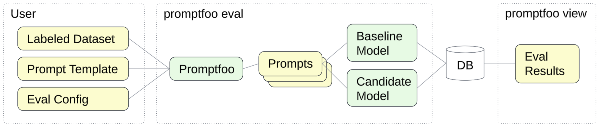

# Summarization
### _Eval Recipe for model migration_

This Eval Recipe demonstrates how to compare performance of a Summarization prompt with Gemini 1.0 and Gemini 2.0 using a labeled dataset and open source evaluation tool [Promptfoo](https://www.promptfoo.dev/).



- Use case: summarize a news article.

- The Evaluation Dataset[^1] includes 5 news articles stored as plain text files, and a JSONL file with ground truth labels: [`dataset.jsonl`](./dataset.jsonl). Each record in this file includes 2 attributes wrapped in the `vars` object. This structure allows Promptfoo to inject the article text into the prompt template, and find ground truth label required to score the quality of model-generated summaries:
    - `document`: relative path to the plain text file containing the news article
    - `summary`: ground truth label (short summary of the article)

- Prompt Template is a zero-shot prompt located in [`prompt_template.txt`](./prompt_template.txt) with variable `document` that gets populated from the corresponding dataset attribute.

- [`promptfooconfig.yaml`](./promptfooconfig.yaml) contains all Promptfoo configuration:
    - `providers`: list of models that will be evaluated
    - `prompts`: location of the prompt template file
    - `tests`: location of the labeled dataset file
    - `defaultTest`: defines the scoring logic:
        1. `type: rouge-n` rates similarity between the model response and the ground truth label
        1. `value: "{{summary}}"` instructs Promptfoo to use the "summary" dataset attribute as the ground truth label

## How to run this Eval Recipe

- Google Cloud Shell is the easiest option as it automatically clones our Github repo:

    <a href="https://console.cloud.google.com/cloudshell/open?git_repo=https://github.com/GoogleCloudPlatform/applied-ai-engineering-samples&cloudshell_git_branch=main&cloudshell_workspace=genai-on-vertex-ai/gemini/model_upgrades">
        
    </a>

- Alternatively, you can use the following command to clone this repo to any Linux environment with configured [Google Cloud Environment](https://cloud.google.com/vertex-ai/docs/start/cloud-environment):

    ``` bash
    git clone --filter=blob:none --sparse https://github.com/GoogleCloudPlatform/applied-ai-engineering-samples.git && \
    cd applied-ai-engineering-samples && \
    git sparse-checkout init && \
    git sparse-checkout set genai-on-vertex-ai/gemini/model_upgrades && \
    git pull origin main
    cd genai-on-vertex-ai/gemini/model_upgrades
    ```

1. Install Promptfoo using [these instructions](https://www.promptfoo.dev/docs/installation/).
1. Navigate to the Eval Recipe directory in terminal and run the command `promptfoo eval`.

    ``` bash
    cd summarization/promptfoo
    promptfoo eval
    ```

1. Run `promptfoo view` to analyze the eval results. You can switch the Display option to `Show failures only` in order to investigate any underperforming prompts.

## How to customize this Eval Recipe:
1. Copy the configuration file `promptfooconfig.yaml` to a new folder.
1. Add your labeled dataset file with JSONL schema similar to `dataset.jsonl`. 
1. Save your prompt template to `prompt_template.txt` and make sure that the template variables map to the variables defined in your dataset.
1. That's it! You are ready to run `promptfoo eval`. If needed, add alternative prompt templates or additional metrics to promptfooconfig.yaml as explained [here](https://www.promptfoo.dev/docs/configuration/parameters/).

[^1]: Dataset ([XSum](https://github.com/EdinburghNLP/XSum)) citation:
 @InProceedings{xsum-emnlp,
  author    = {Shashi Narayan and Shay B. Cohen and Mirella Lapata},
  title     = {Don't Give Me the Details, Just the Summary! {T}opic-Aware Convolutional Neural Networks for Extreme Summarization},
  booktitle = {Proceedings of the 2018 Conference on Empirical Methods in Natural Language Processing},
  year      = {2018},
  address   = {Brussels, Belgium},
}