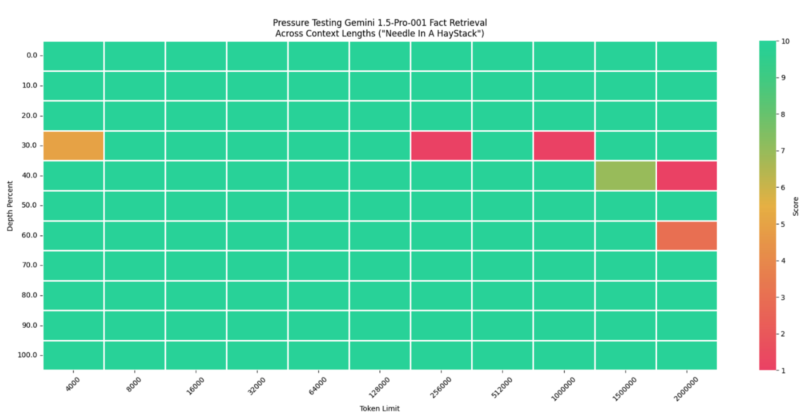

# Needle In A Haystack - Pressure Testing LLMs

This repository is a fork of [Greg Kamradt's](https://twitter.com/GregKamradt) needle-in-a-haystack repository. 

Original Repository: https://github.com/gkamradt/LLMTest_NeedleInAHaystack


## What is the 'Needle in a Haystack' Test?

The 'Needle in a Haystack' test is a common technique used to evaluate the performance of a language model on long context windows. The basic idea is to place a random fact or statement (the 'needle') in the middle of a long context window (the 'haystack') and then ask the model to retrieve this statement. By varying the depth of the needle within the haystack and the length of the context window, we can measure how well the model can retrieve the correct statement.

### Steps

1. Place a random fact or statement (the 'needle') in the middle of a long context window (the 'haystack')
2. Ask the model to retrieve this statement
3. Compare the model's response to the actual needle (we use an LLM to score the similarity)
4. Iterate over various document depths (where the needle is placed) and context lengths to measure performance robustly


This test has been used in a number of papers to evaluate the performance of LLMs on long context windows, including the [Gemini 1.5 paper](https://arxiv.org/pdf/2403.05530).

## Differences from Original Repository
This fork adds support for using **Vertex AI Gemini** (and only Vertex AI Gemini) models.

It also differs in that the needle behavior matches that used in the [Gemini 1.5 paper](https://arxiv.org/pdf/2403.05530). Quoting from the paper:

> We insert a needle at linearly spaced intervals from the beginning to the end of the context, where
the needle is i.e., “The special magic {city} number is: {number}” where the city and
number are varied for each query, and query the model to return the magic number for a specific
city.

This dynamic needle is to prevent false positives due to caching. To revert to the original static needle behavior use `--dynamic_needle=False`


## How to Use

### Setup Google Cloud Project

1. Make sure that [billing is enabled for your Google Cloud project](https://cloud.google.com/billing/docs/how-to/verify-billing-enabled#confirm_billing_is_enabled_on_a_project).
2. Make sure that the [Vertex AI API](https://console.cloud.google.com/flows/enableapi?apiid=aiplatform.googleapis.com) is enabled for your project.


You can run the following steps in [Cloud Shell](https://cloud.google.com/shell/docs/using-cloud-shell) or [Vertex AI Workbench](https://cloud.google.com/vertex-ai-notebooks) or [Colab Enterprise](https://cloud.google.com/colab/docs/introduction).


### Clone Repository

You may run the following commands from your local terminal or from [Google Cloud Shell](https://cloud.google.com/shell/docs/overview). We tested the code using Python 3.11 but other versions may work.

```zsh
git clone https://github.com/GoogleCloudPlatform/applied-ai-engineering-samples.git
cd applied-ai-engineering-samples/genai-on-vertex-ai/gemini/needle_in_a_haystack
```

### Setup Virtual Environment

We recommend setting up a virtual environment to isolate Python dependencies, ensuring project-specific packages without conflicting with system-wide installations. 

```zsh
python3 -m venv venv
source venv/bin/activate
```

### Install Requirements

```zsh
pip install -e .
```

### Quickstart Configurations

Run a test with a single context length and document depth.
```zsh
needlehaystack.run_test --gcp_project_id <YOUR_PROJECT_ID>  --document_depth_percents "[50]" --context_lengths "[200]"
```

Run a test with 11 different context lengths ranging from 4,000 to 2,000,000 tokens and 11 evenly spaced document depths for each context length. This will result in 11*11 = 121 tests and can take a while to run.
```zsh
needlehaystack.run_test --gcp_project_id <YOUR_PROJECT_ID> --document_depth_percent_intervals 11 --context_lengths "[4000,8000,16000,32000,64000,128000,256000,512000,1000000,1500000,2000000]"
```

In the event of an individual test failure due to rate limits or other issues, the program will print the exception and move on to the next test. If you re-run the command at a later time it will check the `results/` directory and skip any tests that have already been completed.

### Output and Interpretation

The results will be saved to the `results/` directory, one .json file per test.

You may generate a visualization of these results using the notebook [niah_visualize.ipynb](needlehaystack/niah_visualize.ipynb) that will look like the below:



- x-axis - Size of context window (tokens)
- y-axis - Depth of needle placement within context. 0 = beginning, 100 = end.
- colors - The agreement of the ground truth needle vs the model retrieved needle. Green corresponds to 10/10 agreement, Red corresponds to 1/10 agreement, in between colors indicate partial agreement. 


### Configuration Options

You may modify your test configuration with the following options:

- `gcp_project_id` - The GCP project ID used to run the test. 
- `model_name` - Model name of the language model accessible by the provider. Defaults to `gemini-1.5-pro`
- `evaluator_model_name` - Model name of the language model accessible by the evaluator. Defaults to `gemini-1.5-pro`
- `dynamic_needle` - Whether to use the dynamic needle or not. Defaults to `True`
- `needle` - The statement or fact which will be placed in your context. Only used if `dynamic_needle=False`
- `haystack_dir` - The directory which contains the text files to load as background context. Only text files are supported
- `retrieval_question` - The question with which to retrieve your needle in the background context
- `results_version` - You may want to run your test multiple times for the same combination of length/depth, change the version number if so
- `num_concurrent_requests` - Default: 1. Set higher if you'd like to run more requests in parallel. Keep in mind rate limits.
- `save_results` - Whether or not you'd like to save your results to file. They will be temporarily saved in the object regardless. True/False. If `save_results = True`, then this script will populate a `result/` directory with evaluation information. Due to potential concurrent requests each new test will be saved as a few file.
- `save_contexts` - Whether or not you'd like to save your contexts to file. **Warning** these will get very long. True/False
- `final_context_length_buffer` - The amount of context to take off each input to account for system messages and output tokens. This can be more intelligent but using a static value for now. Default 200 tokens.
- `context_lengths_min` - The starting point of your context lengths list to iterate
- `context_lengths_max` - The ending point of your context lengths list to iterate
- `context_lengths_num_intervals` - The number of intervals between your min/max to iterate through
- `context_lengths` - A custom set of context lengths. This will override the values set for `context_lengths_min`, max, and intervals if set
- `document_depth_percent_min` - The starting point of your document depths. Should be int > 0
- `document_depth_percent_max` - The ending point of your document depths. Should be int < 100
- `document_depth_percent_intervals` - The number of iterations to do between your min/max points
- `document_depth_percents` - A custom set of document depths lengths. This will override the values set for `document_depth_percent_min`, max, and intervals if set
- `document_depth_percent_interval_type` - Determines the distribution of depths to iterate over. 'linear' or 'sigmoid
- `seconds_to_sleep_between_completions` - Default: None, set # of seconds if you'd like to slow down your requests
- `print_ongoing_status` - Default: True, whether or not to print the status of test as they complete


## License

This project is licensed under the MIT License - see the [LICENSE](LICENSE.txt) file for details. Use of this software requires attribution to the original author and project, as detailed in the license.
