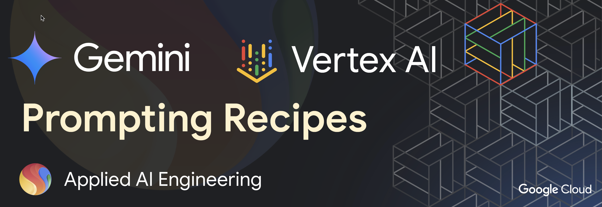

## Vertex AI: Exploring Gemini's multimodal and long context window capabilities

This folder contains code samples and guidance for how to leverage Gemini's unique multimodal and long context window capabilities on Vertex AI.

<table>

  <tr>
    <th style="text-align: center;">Recipe</th>
    <th style="text-align: center;">Description</th>
  </tr>
  <tr>
    <td>
      <a href="./multimodal"><code>multimodal/</code></a>
    </td>
    <td>
      Multimodal prompting with Gemini
    </td>
  </tr>

  <tr>
    <td>
      <a href="./pdf_processing/"><code>pdf_processing/</code></a>
    </td>
    <td>
      Analyzing large PDF files with Gemini
    </td>
  </tr>

  <tr>
    <td>
      <a href="./long_context_window/"><code>long_context_window/</code></a>
    </td>
    <td>
      Leveraging Gemini's 2M token context window to analyze long documents
    </td>
  </tr>

</table>