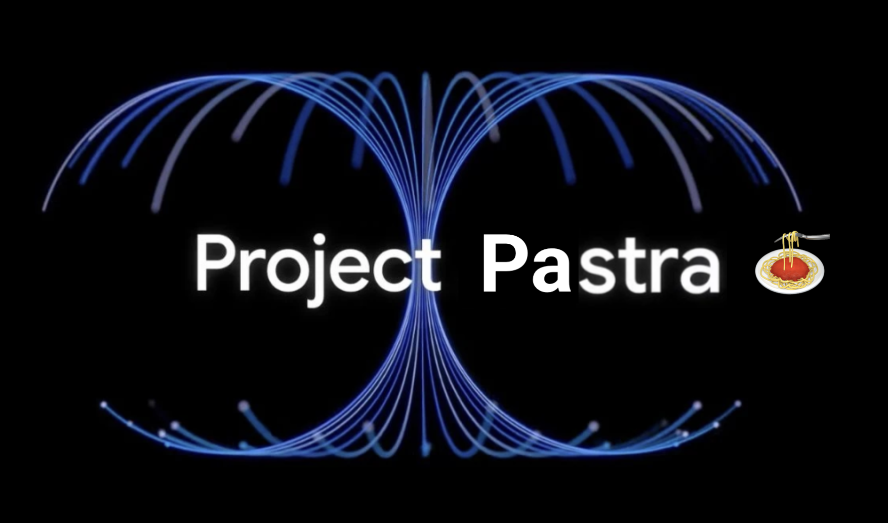

# Project Pastra - A Gemini Multimodal Live API Developer Guide

This repository serves as a comprehensive developer guide for [Google's Gemini Multimodal Live API](https://developers.googleblog.com/en/gemini-2-0-level-up-your-apps-with-real-time-multimodal-interactions/). Through a structured, hands-on approach, you'll learn how to build sophisticated real-time applications that can see, hear, and interact naturally using Gemini's multimodal capabilities.

## What You'll Learn

By following this guide, you'll be able to:
- Build real-time audio chat applications with Gemini
- Implement live video interactions through webcam and screen sharing
- Create multimodal experiences combining audio and video
- Deploy production-ready AI assistants
- Choose between Development API and Vertex AI implementations

The guide progresses from basic concepts to advanced implementations, culminating in a [Project Astra](https://deepmind.google/technologies/project-astra/)-inspired AI assistant that demonstrates the full potential of the Gemini Multimodal Live API.

## Key Concepts Covered

- **Real-time Communication:**
  - WebSocket-based streaming
  - Bidirectional audio chat
  - Live video processing
  - Turn-taking and interruption handling

- **Audio Processing:**
  - Microphone input capture
  - Audio chunking and streaming
  - Voice Activity Detection (VAD)
  - Real-time audio playback

- **Video Integration:**
  - Webcam and screen capture
  - Frame processing and encoding
  - Simultaneous audio-video streaming
  - Efficient media handling

- **Production Features:**
  - Function calling capabilities
  - System instructions
  - Mobile-first UI design
  - Cloud deployment
  - Enterprise security

## Guide Structure

### [Part 1](part_1_intro): Introduction to Gemini's Multimodal Live API
Basic concepts and SDK usage:
- SDK setup and authentication
- Text and audio interactions
- Real-time audio chat implementation

### [Part 2](part_2_dev_api): WebSocket Development with [Gemini Developer API](https://ai.google.dev/api/multimodal-live)
Direct WebSocket implementation, building towards Project Pastra - a production-ready multimodal AI assistant inspired by Project Astra:
- Low-level WebSocket communication
- Audio and video streaming
- Function calling and system instructions
- Mobile-first deployment

### [Part 3](part_3_vertex_api): WebSocket Development with [Vertex AI API](https://cloud.google.com/vertex-ai/generative-ai/docs/model-reference/multimodal-live)
Enterprise-grade implementation using Vertex AI, mirroring Part 2's journey with production-focused architecture:
- Proxy-based authentication
- Service account integration
- Cloud deployment architecture
- Enterprise security considerations

## Feature Implementation Guide

Below is a comprehensive overview of where each feature is implemented across the Development API and Vertex AI versions:

| Feature | Part 2 - Dev API Chapter | Part 3 - Vertex AI Chapter |
|---------|----------------|-------------------|
| Basic WebSocket Setup | [Chapter 3](part_2_dev_api/chapter_03) | - |
| Text-to-Speech | [Chapter 4](part_2_dev_api/chapter_04) | - |
| Real-time Audio Chat | [Chapter 5](part_2_dev_api/chapter_05) | [Chapter 9](part_3_vertex_api/chapter_09) |
| Multimodal (Audio + Video) | [Chapter 6](part_2_dev_api/chapter_06) | [Chapter 10](part_3_vertex_api/chapter_10) |
| Function Calling & Instructions | [Chapter 7](part_2_dev_api/chapter_07) | [Chapter 11](part_3_vertex_api/chapter_11) |
| Production Deployment (Project Pastra)| [Chapter 8](part_2_dev_api/chapter_08) | [Chapter 12](part_3_vertex_api/chapter_12) |

Note: Vertex AI implementation starts directly with advanced features, skipping basic WebSocket and text-to-speech examples.

## Prerequisites

- Google Cloud Project (for Vertex AI)
- [AI Studio API key](https://aistudio.google.com/app/apikey) (for Gemini Developer API)
- OpenWeather API key (if you want to use the weather tool)
- Python 3.9 or higher
- Modern web browser
- Basic understanding of:
  - JavaScript and HTML
  - WebSocket communication
  - Audio/video processing concepts

## Key Differences Between Dev API and Vertex AI

### Development API (Part 2)
- Simple API key authentication
- Direct WebSocket connection
- All tools available simultaneously
- Single-service deployment
- Ideal for prototyping and learning

### Vertex AI (Part 3)
- Service account authentication
- Proxy-based architecture
- Single tool limitation
- Two-service deployment (app + proxy)
- Suited for enterprise deployment

## Getting Started

1. Start with Part 1 to understand basic SDK concepts
2. Choose your implementation path:
   - For quick prototyping: Follow Part 2 (Dev API)
   - For enterprise deployment: Skip to Part 3 (Vertex AI)

## License

This project is licensed under the Apache License.

