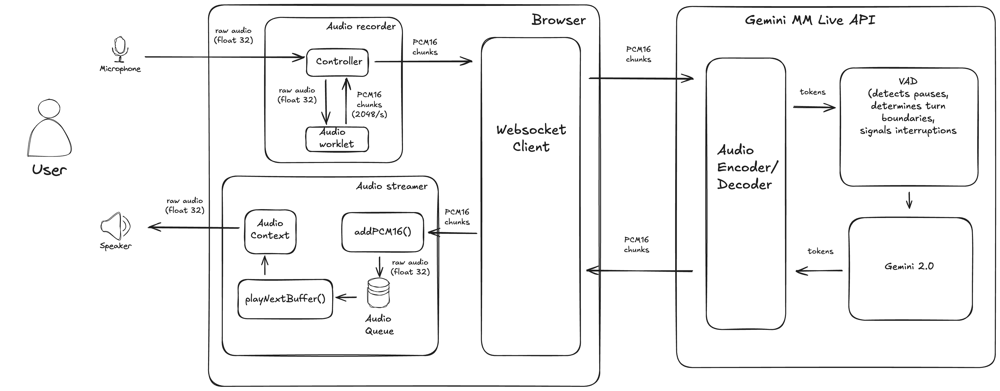

# Chapter 5: Gemini Live Audio Chat - Real-time Audio-to-Audio with WebSockets

This chapter presents a real-time audio-to-audio chat application that interacts with the Gemini Multimodal Live API using WebSockets and the Web Audio API. It demonstrates a browser-based implementation that captures live microphone input, sends it to the Gemini API, and plays back the model's audio response in real time.

**This chapter builds upon the concepts introduced in previous chapters but introduces significantly more complexity** due to the use of raw WebSockets for bidirectional communication and advanced audio processing techniques for handling live audio streams.

**How This Chapter Differs from Previous Chapters:**

*   **Chapter 2 (Live Audio Chat with Gemini):** Utilized the Python SDK for simplifying the audio streaming, but didn't run in the browser. It handled audio-to-audio but with the assistance of the SDK's higher-level abstractions. **Importantly, Chapter 2 used a `model_speaking` flag on the client-side to prevent the model's output from being treated as input.** This chapter achieves a similar outcome through a different mechanism, relying on the API's turn management.
*   **Chapter 3 (Low-Level WebSocket Interaction - Single Exchange Example):** Introduced low level WebSocket interaction but only for sending a single text query to the model.
*   **Chapter 4 (Text-to-Speech with WebSockets):** Focused on text-to-speech, sending text to the API and playing back the received audio. It introduced basic audio handling but did not involve live microphone input or complex audio stream management.

**Chapter 5, in contrast, combines the real-time nature of Chapter 2 with the low-level WebSocket approach of Chapters 3 and 4 but implements a full audio-to-audio chat entirely within the browser.** This requires handling:

*   **Live Microphone Input:** Capturing and processing a continuous stream of audio data from the user's microphone.
*   **Bidirectional Audio Streaming:** Sending audio chunks to the API while simultaneously receiving and playing back audio responses in real time.
*   **Advanced Audio Processing:** Converting between audio formats, managing audio buffers, and ensuring smooth playback using the Web Audio API.
*   **Complex State Management:** Handling interruptions, turn-taking, and potential errors in a real-time audio stream.

**Why the Increased Complexity?**

The jump in complexity comes from the need to manage real-time, bidirectional audio streams directly within the browser using low-level APIs. This involves:

*   **No SDK Abstraction:** We're working directly with WebSockets and handling the raw message formats defined by the Gemini API, including setup and control messages.
*   **Manual Audio Handling:** We must manually capture, chunk, encode, decode, process, and play audio data, without the convenience of an SDK's built-in methods.
*   **Real-time Constraints:** We need to ensure that audio is processed and played back with minimal latency to maintain a natural conversational flow.
*   **Asynchronous Operations:** We rely heavily on asynchronous JavaScript and Promises to manage the non-blocking nature of WebSockets and audio processing.

## Project Structure

This chapter's application consists of the following files:

*   **`index.html`:** The main HTML file that sets up the user interface (a microphone button and an output area for messages) and includes the core JavaScript logic for WebSocket communication and overall application flow.
*   **`audio-recorder.js`:**  Contains the `AudioRecorder` class, which handles capturing audio from the microphone, converting it to the required format, and emitting chunks of audio data using an `EventEmitter3` interface.
*   **`audio-streamer.js`:** Contains the `AudioStreamer` class, which manages audio playback using the Web Audio API. It handles queuing, buffering, and playing audio chunks received from the API, ensuring smooth and continuous playback.
*   **`audio-recording-worklet.js`:** Defines an `AudioWorkletProcessor` that runs in a separate thread and performs the low-level audio processing, including float32 to int16 conversion and chunking.
*   **`audioworklet-registry.js`:** A utility to help register and manage `AudioWorklet`s, preventing duplicate registration.
*   **`utils.js`:** Provides utility functions like `audioContext` (for creating an `AudioContext`) and `base64ToArrayBuffer` (for decoding base64 audio data).
*   **`style.css`:** Contains basic CSS styles for the user interface.

## System Architecture



## Detailed Explanation of Audio Processing

The audio processing pipeline in this application is crucial for real-time performance. Let's break down the components, design choices, and address the specific questions raised:

**1. Microphone Input and `AudioRecorder`:**

*   **`AudioRecorder` Class:** This class encapsulates the logic for capturing audio from the user's microphone using the browser's `MediaDevices` API (`navigator.mediaDevices.getUserMedia`).
*   **`AudioWorklet`:** It utilises an `AudioWorklet` to perform audio processing in a separate thread, preventing the main thread from being blocked by computationally intensive audio operations, which is essential for maintaining a smooth user experience.
*   **`audio-recording-worklet.js`:** This file defines the `AudioProcessingWorklet` class, which extends `AudioWorkletProcessor`. It performs the following:
    *   **Float32 to Int16 Conversion:** Converts the raw audio data from Float32 format (used by the Web Audio API) to Int16 format (required by the Gemini API for PCM audio). The conversion involves scaling the Float32 values (ranging from -1.0 to 1.0) to the Int16 range (-32768 to 32767).
        ```javascript
        // convert float32 -1 to 1 to int16 -32768 to 32767
        const int16Value = float32Array[i] * 32768;
        ```
    *   **Chunking:** Buffers audio samples and sends them in chunks. This is where the frequency of audio transmission is determined. The `buffer` has a fixed length of **2048 samples**. When the `bufferWriteIndex` reaches the end of the buffer, the `sendAndClearBuffer` function is called. The buffer is sent via `postMessage` and then cleared, ready for new data.
        ```javascript
          // send and clear buffer every 2048 samples,
          buffer = new Int16Array(2048);

          // ...

          if(this.bufferWriteIndex >= this.buffer.length) {
            this.sendAndClearBuffer();
          }

          // ...

          sendAndClearBuffer() {
            this.port.postMessage({
              event: "chunk",
              data: {
                int16arrayBuffer: this.buffer.slice(0, this.bufferWriteIndex).buffer,
              },
            });
            this.bufferWriteIndex = 0;
          }
        ```
        **At the input sample rate of 16000 Hz, a chunk of 2048 samples is created and sent approximately every 128 milliseconds (2048 / 16000 = 0.128 seconds).**
*   **EventEmitter3:** The `AudioRecorder` class extends `EventEmitter3`, allowing it to emit events. Specifically, it emits a `data` event whenever a chunk of audio data is ready to be sent. Other parts of the application can listen for this event to receive the audio data.
*   **`start()` and `stop()` Methods:** These methods control the recording process, starting and stopping the microphone capture and managing the associated resources.

**2. WebSocket Communication (`index.html`)**

*   **`ws.onopen`:** Sends the initial `setup` message to the Gemini API, specifying the model, audio output as the response modality, and the desired voice.
*   **`ws.onmessage`:**  Handles incoming messages from the API:
    *   **`setupComplete`:** Enables the microphone button, indicating that the connection is ready.
    *   **`serverContent`:** Processes audio data, handles interruptions, and sends continuation signals as needed.
*   **`sendAudioChunk()`:** This function is triggered by the `data` event emitted by the `AudioRecorder`. It takes a chunk of audio data (which has already been converted to Int16 and then to base64 in the `AudioRecorder`), constructs a `realtime_input` message, and sends it to the API via `ws.send()`. The message format adheres to the `BidiGenerateContentRealtimeInput` structure defined in the API documentation.
*   **`sendEndMessage()` and `sendContinueSignal()`:** These are crucial for managing the conversation flow.
    *   **`sendEndMessage()`:** Sends a message with `turn_complete: true` when the user stops recording (by clicking the "Stop Mic" button). This signals to the API that the user's turn is finished.
        ```javascript
            const message = {
              client_content: {
                turns: [{
                  role: "user",
                  parts: [] // no more audio for this turn
                }],
                turn_complete: true // end of turn
              }
            };
        ```
    *   **`sendContinueSignal()`:** Sends a message with `turn_complete: false` immediately after receiving an audio chunk from the model, *unless* the model indicates `turnComplete: true`. This serves as a keep-alive, letting the API know that the client is still listening and ready for more audio data. This is important for the low-latency, real-time nature of the interaction.
    ```javascript
        const message = {
          client_content: {
            turns: [{
              role: "user",
              parts: [] // no more audio for this turn
            }],
            turn_complete: false // not the end of turn, keep going
          }
        };
    ```
*   **`toggleMicrophone()`:**  Starts and stops the recording process, calling the appropriate methods in `AudioRecorder`.

**3. Audio Playback and `AudioStreamer`:**

*   **`AudioStreamer` Class:** This class manages the playback of audio chunks received from the Gemini API.
*   **`AudioContext`:** It utilizes the Web Audio API's `AudioContext` for handling audio playback. The `AudioContext` is initialized only when the first audio chunk is received to comply with browser autoplay policies. It sets a sample rate of 24000 Hz.
    *   **Lazy Initialization:** The `AudioContext` is only created when the first audio chunk is received. This is because some browsers restrict audio playback unless it's initiated by a user action.
    *   **Sample Rate:** The sample rate is set to 24000 Hz, which is a common sample rate for speech audio.
*   **`addPCM16()`:** This method receives PCM16 audio chunks, converts them back to Float32, creates `AudioBuffer` objects, and adds them to an internal queue (`audioQueue`).
*   **`playNextBuffer()`:** This method retrieves audio buffers from the queue and plays them using an `AudioBufferSourceNode`. It ensures that chunks are played sequentially, one after the other, using the `onended` event of the source node and a small delay.
*   **`isPlaying` Flag:** This flag tracks whether audio is currently being played, preventing overlapping playback.
*   **`stop()` and `resume()`:** These methods provide control over stopping and resuming audio playback.
*   **`complete()`:** This method is called to signal the end of an audio stream, allowing any remaining buffers in the queue to be played out.
*   **Stall Detection:** Implements a mechanism to detect and recover from playback stalls, ensuring continuous audio flow. The `checkPlaybackStatus()` function periodically checks if audio playback has stalled (by comparing the current time with the last playback time). If a stall is detected and there are still buffers in the queue, it attempts to restart playback by calling `playNextBuffer()`. This is a safety net to handle situations where the `onended` event might not fire reliably or if there are unexpected delays in audio processing.
    ```javascript
        checkPlaybackStatus() {
          // Clear any existing timeout
          if (this.playbackTimeout) {
            clearTimeout(this.playbackTimeout);
          }

          // Set a new timeout to check playback status
          this.playbackTimeout = setTimeout(() => {
            const now = this.context.currentTime;
            const timeSinceLastPlayback = now - this.lastPlaybackTime;

            // If more than 1 second has passed since last playback and we have buffers to play
            if (timeSinceLastPlayback > 1 && this.audioQueue.length > 0 && this.isPlaying) {
              console.log('Playback appears to have stalled, restarting...');
              this.playNextBuffer();
            }

            // Continue checking if we're still playing
            if (this.isPlaying) {
              this.checkPlaybackStatus();
            }
          }, 1000);
        }
    ```

**4. Interruption Handling:**

*   **Detection:** The API signals an interruption by sending a `serverContent` message with the `interrupted` flag set to `true`. This typically happens when the API's VAD detects speech from the user while the model is still speaking.
    ```javascript
      if (wsResponse.serverContent.interrupted) {
        logMessage('Gemini: Interrupted');
        isInterrupted = true;
        audioStreamer.stop();
        return;
      }
    ```
*   **Client-Side Handling:** When the `interrupted` flag is received:
    1. The `isInterrupted` flag is set to `true`.
    2. The `AudioStreamer`'s `stop()` method is called to immediately halt any ongoing audio playback. This ensures that the interrupted audio is not played.
*   **Latency:** The latency for interruption detection is primarily determined by the API's VAD and the network latency. The client-side processing adds minimal delay. On a fast connection, the interruption should feel near-instantaneous.
*   **No Specific Parameter:** There is no specific parameter in this code to tune the interruption sensitivity, as that is primarily controlled by the API's VAD.
*   **Effects of Changing VAD (if possible):** If the API provided a way to adjust VAD sensitivity (which it currently doesn't for the Multimodal Live API), the effects would be:
    *   **More Sensitive VAD:** Interruptions would be triggered more easily, potentially leading to a more responsive but also more "jumpy" conversation.
    *   **Less Sensitive VAD:** The model would be more likely to finish its turn, but it might feel less responsive to user interruptions.

**5. Preventing Feedback Loop (No Echo):**
In Chapter 2 with the Python SDK we introduced a `model_speaking` flag to prevent to model from listening to itself. In this chapter, we achieve this without an explicit flag on the client-side, **relying on the API's built-in turn management capabilities.** Here's how it works:

* **Turn Detection:** The Gemini API uses its Voice Activity Detection (VAD) to determine when a user's turn begins and ends. When the user starts speaking, the VAD detects this as the start of a turn. When the user stops speaking for a certain duration (a pause), the VAD determines that the user's turn has ended.

* **`turn_complete` Signal:** The `turn_complete: true` signal sent in the `sendEndMessage()` function after the user stops speaking explicitly tells the API that the user's turn is over. This is important for the API to properly segment the conversation. The sending of this signal is directly tied to the user clicking the "Stop Mic" button, which in turn is only clickable when the user is speaking. This means the user has control when a turn ends.

* **API-Side Management:** The API manages the conversation flow internally, ensuring that the model only processes audio input that is considered part of the user's turn. The model does not start generating its response until the user's turn is deemed complete (either by `turn_complete: true` or by the VAD detecting a sufficiently long pause).

* **`sendContinueSignal()`:** The `sendContinueSignal()` function sends `turn_complete: false` after model audio is received unless the model indicated `turn_complete: true`. This is important. Without that the model would not continue to speak if the generated audio takes longer than the VAD's pause detection.

Essentially, the API is designed to handle the "listen while speaking" scenario gracefully. It's not simply feeding the output audio back into the input. The VAD and turn management logic ensure that the model only processes audio it considers as user input.

**6. Audio Streaming and Context Window:**

*   **Continuous Streaming:** As long as the microphone is active and the user is speaking, audio data is continuously sent to the Gemini API in chunks. This is necessary for real-time interaction.
*   **Chunk Size and Data Rate:**
    *   Each chunk contains 2048 samples of 16-bit PCM audio.
    *   Each sample is 2 bytes (16 bits = 2 bytes).
    *   Therefore, each chunk is 2048 samples * 2 bytes/sample = 4096 bytes.
    *   Chunks are sent roughly every 128 milliseconds.
    *   This translates to a data rate of approximately 4096 bytes / 0.128 seconds = 32 KB/s (kilobytes per second).
    *   **VAD and Turn Boundaries:** The API's VAD plays a crucial role in determining the boundaries of a turn. When VAD detects a significant enough pause in the user's speech, it considers the turn to be over, and the model generates a response based on that segment of audio.
    *   **Practical Implications:** For a natural conversational flow, it's generally a good practice to keep your utterances relatively concise and allow for turn-taking. This helps the API process the audio effectively and generate relevant responses.

**7. User Interface (`index.html`)**

*   **"Start Mic"/"Stop Mic" Button:** This button controls the microphone recording. Its text toggles between "Start Mic" and "Stop Mic" depending on the recording state.
*   **Output Area:** The `div` with the ID `output` is used to display messages to the user, such as "Recording started...", "Recording stopped...", "Gemini: Speaking...", and "Gemini: Finished speaking".
*   **Visual Feedback:** The UI provides basic visual feedback about the state of the application (recording, playing audio, etc.).
*   **Initial State:** When the page loads, the microphone button is disabled. It is only enabled after the WebSocket connection is successfully established and the setup message exchange is complete.

**8. Debugging**

*   **Browser Developer Tools:** The primary tool for debugging this application is your browser's developer tools (usually accessed by pressing F12).
    *   **Console:** Use the console to view `console.log` messages, errors, and warnings. The code includes numerous `console.log` statements to help you track the flow of execution and the data being processed.
    *   **Network Tab:** Use the Network tab to monitor WebSocket traffic. You can inspect the individual messages being sent and received, including their contents and timing. This is invaluable for understanding the communication with the API.
    *   **Debugger:** Use the JavaScript debugger to set breakpoints, step through the code, inspect variables, and analyze the call stack.
*   **`logMessage()` Function:** This function provides a simple way to display messages in the `output` div on the page, providing visual feedback within the application itself.

**9. Further Considerations**

*   **Error Handling:** The code includes basic error handling, but it could be made more robust by handling specific error codes or messages from the API and providing more informative feedback to the user.
*   **Security:** The API key is currently hardcoded in the HTML file. For production, you should **never** expose your API key directly in client-side code. Instead, use a secure backend server to handle authentication and proxy requests to the API.
*   **Scalability:** This example is designed for a single user. For a multi-user scenario, you would need to manage multiple WebSocket connections and potentially use a server-side component to handle user sessions and routing.
*   **Audio Quality:** The audio quality depends on the microphone, network conditions, and the API's processing. You can experiment with different sample rates and chunk sizes, but these values are often constrained by the API's requirements and the need to balance latency and bandwidth.
*   **Network Latency:** Network latency can significantly impact the real-time performance of the application. There's no single solution to mitigate network latency, but using a server closer to the user's location and optimizing the audio processing pipeline can help.
*   **Audio Level:** There is a `gainNode` to allow for controlling the volume of the output audio in the `AudioStreamer`. This is not used yet but could be exposed to the user through the UI if needed.

## Web Audio API

The Web Audio API is a high-level JavaScript API for processing and synthesizing audio in web applications. It provides a powerful and flexible system for manipulating audio within the browser. It is based on the idea of an **audio graph**, where different **audio nodes** are connected to process an audio stream.

**Key Concepts:**

*   **`AudioContext`:** The primary interface for working with the Web Audio API. It represents an audio-processing graph built from audio nodes. You can only have one `AudioContext` per document. Think of it as the container or the manager for all audio operations.
*   **Audio Nodes:** Building blocks of the audio graph. They perform specific audio processing tasks. Examples include:
    *   **`AudioBufferSourceNode`:** Represents an audio source consisting of in-memory audio data stored in an `AudioBuffer`. Used here to play the audio chunks received from the API.
    *   **`MediaStreamAudioSourceNode`:** Represents an audio source consisting of a `MediaStream` (e.g., from a microphone). Used here to capture audio from the microphone.
    *   **`GainNode`:** Controls the volume (gain) of the audio signal. Used here for potential volume adjustments.
    *   **`AudioWorkletNode`:** A special type of node that allows you to run custom audio processing JavaScript code in a separate thread (the audio rendering thread). This is essential for real-time audio processing as it prevents blocking the main thread and causing glitches. Used here (`audio-recording-worklet.js`) to handle audio chunking and format conversion in a separate thread.
*   **`AudioBuffer`:** Represents a short audio asset residing in memory. Used to hold the audio data of each chunk.
*   **`AudioParam`:** Represents a parameter of an audio node (e.g., the gain of a `GainNode`). Can be automated over time.
*   **`AudioWorklet`:** Enables developers to write custom audio processing scripts that run in a separate thread. This is crucial for performance-sensitive audio applications, as it ensures that audio processing doesn't block the main thread and cause glitches or delays. `AudioWorklet`s are defined in separate JavaScript files (like `audio-recording-worklet.js`) and are added to the `AudioContext` using `audioContext.audioWorklet.addModule()`.

**How This Application Uses the Web Audio API:**

*   **`AudioContext`:** An `AudioContext` is created to manage the entire audio graph. It's initialized with a sample rate of 24000 Hz, matching the API's output sample rate.
*   **`AudioWorkletNode`:** An `AudioWorkletNode` is used to run the `AudioProcessingWorklet` defined in `audio-recording-worklet.js`. This handles the real-time processing of microphone input, converting it to Int16 format and dividing it into chunks.
*   **`AudioBufferSourceNode`:** An `AudioBufferSourceNode` is created for each audio chunk received from the API. The audio data is decoded, converted to Float32, and then used to create an `AudioBuffer` that is assigned to the source node.
*   **`MediaStreamAudioSourceNode`:** A `MediaStreamAudioSourceNode` is created to capture the audio stream from the user's microphone.
*   **`GainNode`:** A `GainNode` is connected to the output for potential volume control.
*   **Connections:** The nodes are connected: `MediaStreamAudioSourceNode` -> `AudioWorkletNode` (for input processing), and `AudioBufferSourceNode` -> `GainNode` -> `AudioContext.destination` (for output).

**Audio Queueing and Buffering:**

*   **`audioQueue`:** This array in `AudioStreamer` acts as a queue for incoming audio chunks. Chunks are added to the queue as they are received from the API.
*   **`playNextBuffer()`:** This function retrieves and plays buffers from the queue sequentially. It uses the `onended` event of the `AudioBufferSourceNode` to trigger the playback of the next chunk, ensuring a continuous stream.
*   **Buffering:** The Web Audio API internally handles some buffering, but the `audioQueue` provides an additional layer of buffering to smooth out any irregularities in the arrival of audio chunks.

**Batched Sending:**

*   The term "batching" isn't explicitly used in the code, but the concept is present in how audio chunks are created and sent. The `AudioWorklet` buffers 2048 samples before sending a chunk. This can be considered a form of batching, as it sends data in discrete units rather than a continuous stream of individual samples. This approach balances the need for real-time responsiveness with the efficiency of sending data in larger packets.

## Configuration and Parameters

The following parameters and values are used in this application and can be customized:

*   **`model`:** `"models/gemini-2.0-flash-exp"` (specifies the Gemini model).
*   **`response_modalities`:** `["audio"]` (requests audio output from the API).
*   **`speech_config`:**
    *   **`voice_config`**:
        *   **`prebuilt_voice_config`**:
            *   **`voice_name`**: `Aoede` (specifies which voice to use).
            Possible values: `Aoede`, `Charon`, `Fenrir`, `Kore`, `Puck`
*   **`sampleRate`:**
    The sample rate is set to 16000 Hz for the input and 24000 Hz for the output. This is dictated by the API's requirements.
    *   **Input (Microphone):** 16000 Hz (set in `audio-recorder.js`). This is a common sample rate for speech recognition.
        *   **Why 16000 Hz for input?** 16000 Hz is a standard sample rate for speech processing and is often used in speech recognition systems because it captures most of the relevant frequency information in human speech while keeping computational costs manageable. Using a higher sample rate for input might not provide significant improvements in speech recognition accuracy for this application.
    *   **Output (API):** 24000 Hz (specified in the API documentation and when creating the `AudioContext`). This is a higher sample rate, providing better audio quality for playback.
        *   **Why 24000 Hz for output?** 24000 Hz is chosen because it's the sample rate at which the API provides audio output. Using this rate ensures that the audio is played back at the correct speed and pitch.
*   **`CHUNK_SIZE` (in `audio-recording-worklet.js`):** 2048 samples. This determines the size of the audio chunks sent to the API. It represents a good balance between latency and processing overhead.
    *   **Calculation:** With a sample rate of 16000 Hz, a 2048-sample chunk corresponds to 2048 / 16000 = 0.128 seconds, or 128 milliseconds.
    *   **Why 2048 samples per chunk?** This value is chosen to balance the need for low latency with the overhead of sending frequent messages. Smaller chunks would result in lower latency but would increase the number of messages sent to the API, potentially leading to higher processing overhead and network congestion. Larger chunks would reduce the frequency of messages but increase latency.
    *   **Effects of Changing `CHUNK_SIZE`:**
        *   **Smaller `CHUNK_SIZE` (e.g., 1024 samples):**
            *   **Pros:** Lower latency (around 64 milliseconds per chunk). The application would feel more responsive.
            *   **Cons:** Increased processing overhead on both the client and server sides due to more frequent message sending and handling. Increased network traffic. The audio might also start to sound choppy and distorted due to potential buffer underruns.
        *   **Larger `CHUNK_SIZE` (e.g., 4096 samples):**
            *   **Pros:** Reduced processing overhead and network traffic.
            *   **Cons:** Higher latency (around 256 milliseconds per chunk). The application would feel less responsive, and the conversation might feel sluggish.
*   **Audio Format:**
    *   **Input:** The microphone provides audio data in Float32 format.
    *   **API Input:** The API expects audio data in 16-bit linear PCM (Int16) format, little-endian.
    *   **API Output:** The API provides audio data in base64-encoded 16-bit linear PCM (Int16) format, little-endian.
    *   **Output:** The `AudioContext` works with Float32 audio data.

## Lessons Learned and Best Practices

Through the development of this real-time audio streaming application, several important lessons were learned, and best practices were discovered:

### Audio Context Setup

*   **Lazy Initialization:** Initialize the `AudioContext` only when needed, typically in response to a user interaction, to comply with browser autoplay policies.

### Audio Buffer Management

*   **Avoid Fixed Buffer Sizes:** Instead of using fixed buffer sizes and trying to manage partial buffers, adapt to the natural chunk sizes provided by the API. Process each chunk as it arrives. This simplifies buffer management and improves playback smoothness.
*   **Don't Overcomplicate:** Simple sequential playback using the `onended` event is often more effective and easier to manage than complex scheduling logic.

### PCM16 Data Handling

*   **Correct Conversion:** Ensure that PCM16 data is correctly interpreted and converted to Float32 format for the Web Audio API. The conversion involves normalizing the 16-bit integer values to the range [-1, 1].

### Playback Timing and Scheduling

*   **Sequential Playback:** Use the `onended` event of `AudioBufferSourceNode` to trigger the playback of the next audio chunk. This ensures that chunks are played sequentially without overlap.
*   **Avoid Aggressive Scheduling:** Do not schedule buffers too far in advance. This can lead to memory issues and make it difficult to handle interruptions.

### Interruption Handling

*   **Immediate Stop:** When an interruption is detected (using the `interrupted` flag from the API), stop the current audio playback immediately using `audioStreamer.stop()`.
*   **State Reset:** Reset the `isInterrupted` flag and any other relevant state variables to prepare for new audio input.
*   **Clear Buffers:** Ensure that any pending audio buffers are cleared to prevent stale audio from playing.

### Protocol Management

*   **Setup Message:** Send the `setup` message as the very first message after establishing the WebSocket connection. This configures the session with the API.
*   **Voice Selection:** In the setup message, select a voice in the speech config, which determines the voice of the audio response.
*   **Continue Signals:** Send `client_content` messages with `turn_complete: false` to maintain the streaming connection and signal that the client is ready for more audio data. Send these signals immediately after receiving and processing an audio chunk from the model.
*   **Turn Completion:** Send a `client_content` message with `turn_complete: true` to indicate the end of the user's turn.

### State Management

*   **Track Essential States:** Keep track of states like `isRecording`, `initialized`, and `isInterrupted` to manage the application flow correctly.
*   **Reset States Appropriately:** Reset these states at the appropriate times, such as when starting a new recording or after an interruption.

### Technical Requirements and Best Practices

*   **`AudioContext` Sample Rate:** Always initialize the `AudioContext` with a sample rate of 24000 Hz for compatibility with the Gemini API.
*   **WebSocket Configuration:** Ensure the WebSocket connection is properly configured with the correct API endpoint and API key.
*   **Event Handling:** Implement proper event handling for all relevant audio and WebSocket events, including `onopen`, `onmessage`, `onerror`, `onclose`, `onended`, and custom events like the `data` event from `AudioRecorder`.
*   **State Management:** Implement robust state management to track the recording state, initialization state, interruption state, and other relevant flags.

### Common Pitfalls to Avoid

*   **Overly Complex Buffer Management:** Avoid using fixed buffer sizes or complex buffering logic when a simpler sequential approach is sufficient.
*   **Aggressive Buffer Scheduling:** Don't schedule audio buffers too far in advance, as this can lead to memory issues and complicate interruption handling.
*   **Incorrect PCM16 Handling:** Ensure that PCM16 data is correctly converted to Float32 format, and that the sample rate is properly considered.
*   **Ignoring `turn_complete`:** Always handle the `turn_complete` signal from the API to properly manage turn-taking.
*   **Neglecting State Management:** Failing to properly manage and reset state variables can lead to unexpected behavior and bugs.
*   **Forgetting Continue Signals:** Remember to send continue signals to maintain the streaming connection, especially during long audio generation.

## Summary

This chapter provides a real-world example of building a real-time, audio-to-audio chat application with the Gemini Multimodal Live API using WebSockets and the Web Audio API. It demonstrates the complexities of handling live audio streams, managing bidirectional communication, and performing necessary audio format conversions, all within a browser environment. It also highlights common pitfalls and best practices discovered during the development process.
