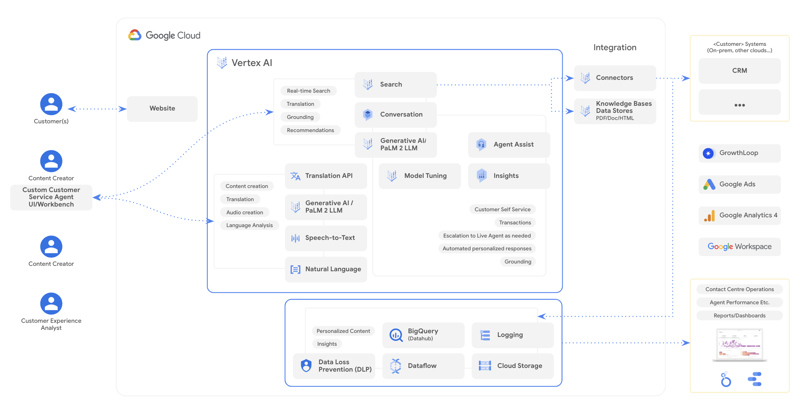

# GenAI for Website Modernization
<br>

## 🔗 Quick Links <a name="quick-links"></a>
- [🔗 Quick Links](#quick-links)
- [📍 Overview](#overview)
- [📦 Features](#features)
- [📂 Repository Structure](#repository-structure)
- [🏗️ Architecture](#architecture)
- [🚀 Getting Started](#getting-started)
    - [⚙️ Initial Setup](#initial-setup)
    - [🤖 Running](#running)
    - [🚀 Deployment](#deployment)
- [🤝 Contributing](#contributing)
- [👏 Acknowledgments](#acknowledgments)

<br>

## 📍 Overview <a name="overview"></a>

Website Modernization Solution aims to enhance content generation by providing LLM powered tools to content creators. It also aims to enhance website navigation by introducing conversational search experiences that promotes the discoverability of various webpages within a particular website. We also integrate this with recommendations to automatically recommend user preferred webpages to increase the probability of user engagement.

The website modernization solution unlocks several key benefits:

* Streamlined Content Creation: Generative AI to enhance the quality and efficiency of your content production. Receive suggestions tailored to improve your articles and ensure they align with your brand's tone and style.

* Visual Impact: Generate professional-grade images that perfectly complement your written content, significantly boosting user engagement.

* Global Reach: Eliminate language barriers with seamless translation, allowing you to connect with a broader, multilingual audience.

* Enhanced Product Discovery: Integrate Vertex Search to provide intuitive navigation and accelerate the user's journey towards finding the products that best suit their needs.

<br>

## 📦 Features <a name="features"></a>

|    | Feature           | Description                                                                                                       |
|----|--------------------|--------------------------------------------------------------------------------------------------------------------|
| ✨ | **AI Powered Content Review and Generation**    | Uses Vertex LLMs like `text-bison-32k` and `gemini-1.5-pro-001` to provide powerful tools for content creators, helping in the creation of more engaging, relevant, and high-quality content.
| 🔎 | **Conversational Search and Discoverability Optimization**    | Vertex Search w/ followups offers an interactive, conversational search interface that enhances website navigation and discoverability. This approach makes it easier for users to find and explore various webpages within the website, thereby improving user experience and content accessibility.
| 😇 | **Personalized Recommendations**    | Integrates Vertex Generic Recommendations that automatically suggests webpages based on individual user preferences and behaviors, aiming to increase user engagement and site stickiness.

<br>

## 📂 Repository Structure <a name="repository-structure"></a>

```sh
└── backend
   ├── Dockerfile
   ├── config.toml                     # Config application and env variables
   ├── main.py                         # Main FastAPI entrypoint

   ├── models/                         # Contains data models used by the application
   │ ├── blog_edit_models.py           # Data models for blog editing functionality
   │ ├── cache_models.py               # Data models for cache management
   │ ├── vertex_imagen_models.py       # Data models for Vertex AI Imagen integration
   │ ├── vertex_llm_models.py          # Data models for Vertex LLMs
   │ └── vertex_search_models.py       # Data models for Vertex AI Search integration

   ├── routers/                        # FastAPI routers for different application functionalities
   │ ├── cache.py                      # Router for cache management
   │ ├── hello.py                      # Basic "hello world" router
   │ ├── page_content_dispatch.py      # Router for managing webpage content edits
   │ ├── vertex_imagen.py              # Router for Vertex AI Imagen integration
   │ ├── vertex_llm.py                 # Router for Vertex AI Language Model integration
   │ └── vertex_search.py              # Router for Vertex AI Search integration

   ├── static/                         # Contains static assets - images and JS files
   │ ├── css/ 
   │ ├── img/
   │ │ ├── blogs/
   │ │ └── home/
   │ ├── js/                           # JavaScript files extending editorjs functionalities
   │ │ ├── ai-tool-autocomplete.js     # Autocomplete functionality using Vertex AI
   │ │ ├── annotation-bundle.js        # Annotation library for collaborative editing
   │ │ ├── blog-GA.js                  # Google Analytics tracking for blog pages
   │ │ ├── common-editor.js            # Common editor configuration and tools
   │ │ ├── header-GA.js                # Google Analytics tracking for header interactions
   │ │ ├── header-wm.js                # Custom header extension
   │ │ ├── llm-refine-text.js          # Text refinement functionality using Vertex AI
   │ │ ├── magi-GA.js                  # Google Analytics tracking for Magi interactions
   │ │ ├── paragraph-wm.js             # Custom paragraph extension
   │ │ ├── simple-image.js             # Simple image tool for EditorJS
   │ │ ├── simple-llm.js               # Inline translation functionality using Vertex AI
   │ │ ├── utils.js                    # Utility functions for the application
   │ │ └── WSMComment2.js              # Collaborative comments functionality (version 2)
   │ │ └── WSMComment3.js              # Collaborative comments functionality (version 3)
   │ └── json/
   │ └── blog/

   ├── templates/                      # Jinja templates for the application
   │ ├── allblog.html                  # Template for the All Blogs page
   │ ├── blog.html                     # Template for individual blog posts
   │ ├── faq.html                      # Template for the FAQ page
   │ ├── home.html                     # Template for the home page
   │ └── magi.html                     # Template for the Magi search results

   └── utils/                          # Utility modules for the application
   │  ├── blog_utils.py                # Utilities for managing blog content
   │  ├── content_cache.py             # Content caching mechanism
   │  ├── content_encoder.py           # Content encoding and decoding utilities
   │  ├── content_utils.py             # Utilities for managing webpage content
   │  ├── gcs.py                       # Google Cloud Storage interaction utilities
   │  └── vertex_llm_utils.py          # Utilities for interacting with Vertex LLMs
   │  └── vertex_search_utils.py       # Utilities for interacting with Vertex AI Search
   ```
<br>

## 🏗️ Architecture <a name="architecture"></a>

The following diagram illustrates the solution architecture and key components.



<br>

## 🚀 Getting Started <a name="getting-started"></a>

Our tech stack comprises of the following:

### 🐍 Backend
1. Our backend APIs are built primarily using `FastAPI`. 
2. We use `Google Cloud Storage` to serve various static assets for the website.
3. The app is deployed on `Google Cloud Run` which can scale up and down depending on the traffic.

### 📺 Frontend
1. Our frontend stack consists of vanilla `HTMX + CSS + JS`.
2. We use `Jinja2` as a templating engine to inject content from the backend.
3. We also use `EditorJS` to provide a WYSIWYG editor for content creators. `EditorJS` gives an easy and opinionated way to create and edit content.

<br>

## ⚙️ Initial Setup <a name="initial-setup"></a>

1. Clone the repository

2. Setup Google Analytics Account

   a. Follow the [instruction](https://support.google.com/analytics/answer/9304153?hl=en#zippy=%2Cadd-the-google-tag-directly-to-your-web-pages) to setup a Google Analytics Account.

   b. Replace the following section in [base.html](./backend/templates/base.html) with the script generated for you by the Google Analytics console.

   ```html
   <!-- Google tag (gtag.js) -->
   <script async src="https://www.googletagmanager.com/gtag/js?id=<YOUR GTAG ID>"></script>
   <script>
      window.dataLayer = window.dataLayer || [];
      function gtag() { dataLayer.push(arguments); }
      gtag('js', new Date());
      gtag('config', '<YOUR GTAG ID>');
   </script>
   ```
3. Configure Vertex AI Search for Generative Search and Recommendations

   a. Start off by preparing and ingesting your data in [Cloud Storage](https://cloud.google.com/generative-ai-app-builder/docs/prepare-data#unstructured). For the purposes of this demo, we have created some sample documents that you can copy to your GCS bucket. Ensure that you have a GCS bucket created before you run the command below:

      ```sh
      gsutil -m rsync -r -d gs://webmod-blog-bucket gs://<your_blog_bucket_name>
      gsutil -m rsync -r -d gs://webmod-blog-images-bucket gs://<your_blog_images_bucket_name>
      ```
   
   b. Next, you can proceed by [creating a search application](https://cloud.google.com/generative-ai-app-builder/docs/try-enterprise-search#create_and_preview_a_search_app_for_unstructured_data_from) to search **unstructured data** from Cloud Storage. Point your datastore to use the GCS bucket created in the previous step as a target

   c. You can also [create a recommendation engine](https://cloud.google.com/generative-ai-app-builder/docs/try-personalize#create_preview_and_deploy_an_app_for_unstructured_data) for the blog pages with the same bucket to serve recommendations on what blogs a user should read next

<br>

### ☕️ Local Testing <a name="local-testing"></a>

1. Create a `virtualenv` for the app and activate it

```sh
python3 -m venv .env
source .env/bin/activate
```

2. Install the dependencies
```sh
pip install -r requirements.txt
```

3. Modify the `config.toml` file to include the missing variables

<br>

### 🤖 Running <a name="running"></a>
Use the following command to run

```sh
cd backend
uvicorn main:app --reload
```
<br>

### 🚀 Deployment <a name="deployment"></a>
[Optional] Update and configure `gcloud`

```sh
# update gcloud components
gcloud components update

# configure gcloud auth
gcloud auth login
gcloud config set project PROJECT_ID
gcloud auth configure-docker
```

Build Dockerfile and deploy container to `Cloud Run`

```sh
# cloud run service: webmod-init on port 8080
gcloud run deploy webmod-svc --port 8080 --source .
```

<br>


## 🤝 Contributing <a name="contributing"></a>

Contributions are welcome! Here are several ways you can contribute:

- **[Submit Pull Requests](https://github.com/local/./blob/main/CONTRIBUTING.md)**: Submit your own PRs
- **[Report Issues](https://github.com/local/./issues)**: If you have any questions or if you found any problems with this repository, please report through GitHub issues.

<br>

## 👏 Acknowledgments <a name="acknowledgements"></a>
[Editor.js](https://github.com/codex-team/editor.js) - Codex Team