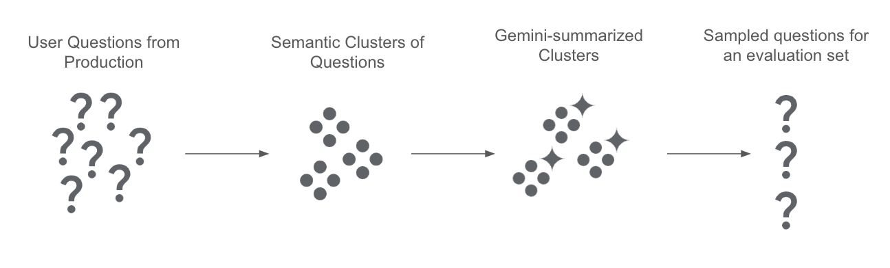

# RAG Evaluation Dataset Curation
Once businesses start to expose a Chatbot or RAG application to real end-users, they will start to observe real queries and conversations. The questions users ask these bots can reveal so much about users, the products they are using/purchasing, and the business itself. This data is valuable for both understanding users and their needs and assessing if the Chatbot you've built is working properly over time. 

The goal of this notebook is to use Gemini to turbo-charge analysis and summarization of real user queries and conversations from an in-production RAG system/Chatbot. We can then use this analysis to identify a representative set of questions which can be used as an evaluation dataset for the RAG system. This notebook can serve as the foundation of a continuous evaluation practice for RAG systems. 

Along the way, we want to learn:
- What are the general classes of questions people are asking?
  - What problems do people have?
- What topics are being discussed?
- What sentiments are being expressed?

This notebook was inspired by an article by [Weights and Biases](https://wandb.ai/wandbot/wandbot-eval/reports/How-to-Evaluate-an-LLM-Part-1-Building-an-Evaluation-Dataset-for-our-LLM-System--Vmlldzo1NTAwNTcy). We take some of the ideas and go a few steps further by using Gemini to analyze and extract metadata about the clusters we find and use that to inform our choosing of an evaluation dataset. Gemini's large context allows us to perform EDA on clusters and questions extremely quickly, even for very large question sets. 